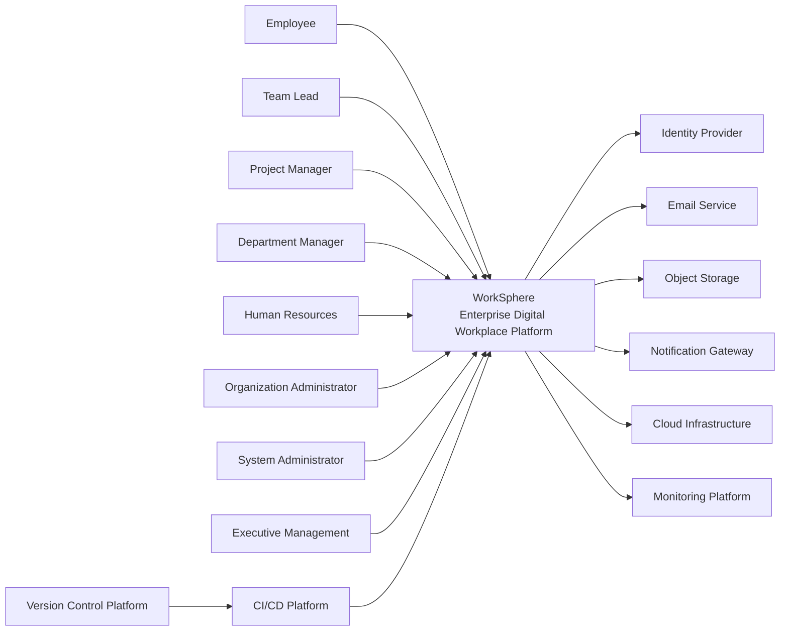

# Context Diagram

## Document Information

+----------------------+----------------------------------------------+
| Attribute            | Value                                        |
+----------------------+----------------------------------------------+
| Document Name        | Context Diagram                              |
| Project              | WorkSphere                                   |
| Version              | 1.0                                          |
| Status               | Approved                                     |
| Owner                | Bhargav Kaushik                              |
| Prepared By          | Bhargav Kaushik                              |
| Last Updated         | July 2026                                    |
+----------------------+----------------------------------------------+

---

# Table of Contents

1. Purpose
2. Scope
3. Context Overview
4. Primary Actors
5. External Systems
6. System Boundary
7. Context Relationships
8. Context Diagram
9. Design Considerations
10. References
11. Version History

---

# 1. Purpose

This document defines the highest-level architectural view of the WorkSphere
platform using the C4 Model Level 1 (System Context Diagram).

It identifies the primary users, external systems, and the interactions
between them and the WorkSphere platform.

The objective is to provide stakeholders with a clear understanding of the
system boundary and the external environment in which WorkSphere operates.

---

# 2. Scope

This document covers:

- System boundary
- Primary actors
- External systems
- High-level interactions
- Context relationships

The internal implementation of WorkSphere, including microservices,
databases, APIs, and infrastructure components, is documented separately in
the System Architecture and subsequent design documents.

---

# 3. Context Overview

WorkSphere is a cloud-native enterprise digital workplace platform that
provides organizations with a centralized environment for collaboration,
project management, document management, task tracking, communication, and
administration.

Users interact with WorkSphere through a web application, while the platform
communicates with selected external services to deliver supporting
capabilities such as identity management, email delivery, object storage,
and infrastructure monitoring.

---

# 4. Primary Actors

The following actors directly interact with the WorkSphere platform.

| Actor | Responsibilities |
|--------|------------------|
| Employee | Performs daily work, collaborates with teams, manages tasks and documents |
| Team Lead | Assigns work, monitors team progress, reviews deliverables |
| Project Manager | Creates and manages projects, milestones, and resources |
| Department Manager | Oversees departmental operations and reporting |
| Human Resources | Manages employee onboarding, offboarding, and organizational records |
| Organization Administrator | Configures organization-level settings and policies |
| System Administrator | Manages platform configuration, security, and operations |
| Executive Management | Reviews dashboards, reports, and business metrics |

---

# 5. External Systems

WorkSphere integrates with the following external systems.

| External System | Purpose |
|-----------------|---------|
| Identity Provider | User authentication and single sign-on |
| Email Service | Transactional and notification emails |
| Object Storage | Storage of documents and attachments |
| Notification Gateway | Push and messaging services |
| Cloud Infrastructure | Hosting and runtime environment |
| Monitoring Platform | Infrastructure and application monitoring |
| CI/CD Platform | Automated build and deployment pipelines |
| Version Control Platform | Source code management |

---

# 6. System Boundary

The WorkSphere platform represents the primary system boundary.

Inside the boundary:

- Enterprise Collaboration
- Workspace Management
- Project Management
- Task Management
- Document Management
- User Management
- Authentication
- Reporting & Analytics
- Notifications
- Audit Logging

Outside the boundary:

- Organizational Users
- Identity Providers
- Email Services
- Object Storage
- Monitoring Systems
- Cloud Infrastructure
- CI/CD Platform
- Source Code Repository

---

# 7. Context Relationships

The following relationships exist between WorkSphere and external entities.

| Source | Relationship | Destination |
|----------|--------------|-------------|
| Employee | Uses | WorkSphere |
| Team Lead | Uses | WorkSphere |
| Project Manager | Uses | WorkSphere |
| Department Manager | Uses | WorkSphere |
| Human Resources | Uses | WorkSphere |
| Organization Administrator | Administers | WorkSphere |
| System Administrator | Operates | WorkSphere |
| Executive Management | Reviews Reports | WorkSphere |
| WorkSphere | Authenticates Through | Identity Provider |
| WorkSphere | Sends Emails Through | Email Service |
| WorkSphere | Stores Files In | Object Storage |
| WorkSphere | Sends Notifications Through | Notification Gateway |
| WorkSphere | Runs On | Cloud Infrastructure |
| WorkSphere | Publishes Metrics To | Monitoring Platform |
| CI/CD Platform | Deploys | WorkSphere |
| Version Control Platform | Stores Source Code For | WorkSphere |

---

# 8. Context Diagram

---

# 9. Design Considerations

The context diagram has been designed according to the following principles:

- Clearly defines the WorkSphere system boundary.
- Identifies all primary business actors.
- Shows only external interactions.
- Excludes internal implementation details.
- Supports future integration with enterprise systems.
- Aligns with the C4 Model Level 1 notation.
- Serves as the foundation for subsequent architecture diagrams.

---

# 10. References

This document should be read together with:

- Project Charter
- Vision Document
- Business Domain Model
- Business Process Catalog
- Functional Requirements Specification
- Non-Functional Requirements
- User Stories
- System Architecture

---

# Approval

+----------------------+----------------------------------------------+
| Role                 | Responsibility                               |
+----------------------+----------------------------------------------+
| Solution Architect   | Reviews context design                       |
| Technical Lead       | Validates system interactions                |
| Project Manager      | Confirms alignment with business objectives  |
| Project Owner        | Maintains and approves this document         |
+----------------------+----------------------------------------------+

---

# Document Maintenance

The Context Diagram shall be updated whenever new external actors,
enterprise integrations, or significant changes to the system boundary
are introduced.

---

# Version History

+---------+------------+----------------------------------------------------------+-------------------+
| Version | Date       | Description                                              | Author            |
+---------+------------+----------------------------------------------------------+-------------------+
| 1.0     | July 2026  | Initial release of Context Diagram                       | Bhargav Kaushik   |
+---------+------------+----------------------------------------------------------+-------------------+

---

# End of Document