# Container Diagram

## Document Information

+----------------------+----------------------------------------------+
| Attribute            | Value                                        |
+----------------------+----------------------------------------------+
| Document Name        | Container Diagram                            |
| Project              | WorkSphere                                   |
| Version              | 1.0                                          |
| Status               | Approved                                     |
| Owner                | Bhargav Kaushik                              |
| Prepared By          | Bhargav Kaushik                              |
| Last Updated         | July 2026                                    |
+----------------------+----------------------------------------------+

---

# Table of Contents

1. Purpose
2. Scope
3. Container Overview
4. Container Responsibilities
5. Container Relationships
6. Container Diagram
7. Design Principles
8. References
9. Version History

---

# 1. Purpose

This document defines the C4 Model Level 2 (Container Diagram) for the
WorkSphere platform.

It illustrates the major deployable containers that collectively form the
WorkSphere system and describes how these containers communicate to deliver
enterprise functionality.

The diagram provides a high-level technical view of the platform without
exposing internal implementation details.

---

# 2. Scope

This document includes:

- Client Applications
- API Gateway
- Business Microservices
- Shared Infrastructure
- Databases
- Object Storage
- Messaging
- Monitoring
- Logging

Internal class design and source code structure are documented separately.

---

# 3. Container Overview

The WorkSphere platform consists of multiple independently deployable
containers.

Each container has a clearly defined responsibility and communicates with
other containers through secure interfaces.

The architecture follows Cloud-Native and Microservices principles.

---

# 4. Container Responsibilities

## C-001 Web Client

Technology

- Angular 20

Responsibilities

- User Interface
- API Consumption
- Client-side Validation
- Session Management

---

## C-002 API Gateway

Technology

- Spring Cloud Gateway

Responsibilities

- Request Routing
- Authentication Validation
- Authorization
- Rate Limiting
- API Aggregation

---

## C-003 Config Server

Technology

- Spring Cloud Config

Responsibilities

- Centralized Configuration
- Environment Configuration
- Configuration Distribution

---

## C-004 Eureka Server

Technology

- Netflix Eureka

Responsibilities

- Service Discovery
- Service Registration
- Health Registry

---

## C-005 Authentication Service

Technology

- Spring Boot

Responsibilities

- Login
- JWT
- Refresh Tokens
- Password Management
- MFA (Future)

---

## C-006 User Service

Responsibilities

- User Profiles
- Employee Management
- Preferences

---

## C-007 Organization Service

Responsibilities

- Organizations
- Departments
- Teams
- Hierarchy

---

## C-008 Workspace Service

Responsibilities

- Workspace Creation
- Membership
- Workspace Settings

---

## C-009 Project Service

Responsibilities

- Projects
- Milestones
- Project Lifecycle

---

## C-010 Task Service

Responsibilities

- Tasks
- Assignment
- Progress Tracking

---

## C-011 Document Service

Responsibilities

- Upload
- Download
- Versioning
- Sharing

---

## C-012 Notification Service

Responsibilities

- Email
- Push Notifications
- In-App Notifications

---

## C-013 Analytics Service

Responsibilities

- Dashboards
- Reports
- KPIs

---

## C-014 Audit Service

Responsibilities

- Audit Logs
- Compliance
- Activity History

---

## C-015 PostgreSQL

Responsibilities

- Persistent Relational Storage

---

## C-016 Redis

Responsibilities

- Distributed Cache
- Session Cache

---

## C-017 RabbitMQ

Responsibilities

- Event Messaging
- Queue Management

---

## C-018 MinIO

Responsibilities

- Document Storage
- File Storage
- Binary Objects

---

## C-019 Prometheus

Responsibilities

- Metrics Collection

---

## C-020 Grafana

Responsibilities

- Dashboards
- Monitoring

---

## C-021 ELK Stack

Responsibilities

- Centralized Logging
- Log Analysis

---

# 5. Container Relationships

| Source | Relationship | Destination |
|---------|--------------|-------------|
| Web Client | Sends HTTPS Requests | API Gateway |
| API Gateway | Routes Requests | Business Services |
| Business Services | Discover Services | Eureka |
| Business Services | Load Configuration | Config Server |
| Business Services | Store Data | PostgreSQL |
| Business Services | Cache Data | Redis |
| Business Services | Publish Events | RabbitMQ |
| Business Services | Store Files | MinIO |
| Business Services | Export Metrics | Prometheus |
| Prometheus | Supplies Metrics | Grafana |
| Business Services | Send Logs | ELK Stack |

---

# 6. Container Diagram

```mermaid
graph TD

%% Client
Client["Angular Web Client"]

%% Gateway
Gateway["Spring Cloud Gateway"]

%% Infrastructure
Config["Config Server"]
Eureka["Eureka Server"]

%% Services
Auth["Authentication Service"]
User["User Service"]
Org["Organization Service"]
Workspace["Workspace Service"]
Project["Project Service"]
Task["Task Service"]
Document["Document Service"]
Notification["Notification Service"]
Analytics["Analytics Service"]
Audit["Audit Service"]

%% Infrastructure Services
Postgres["PostgreSQL"]
Redis["Redis"]
Rabbit["RabbitMQ"]
Minio["MinIO"]
Prometheus["Prometheus"]
Grafana["Grafana"]
ELK["ELK Stack"]

%% Flow
Client --> Gateway

Gateway --> Auth
Gateway --> User
Gateway --> Org
Gateway --> Workspace
Gateway --> Project
Gateway --> Task
Gateway --> Document
Gateway --> Notification
Gateway --> Analytics
Gateway --> Audit

Auth --> Config
User --> Config
Org --> Config
Workspace --> Config
Project --> Config
Task --> Config
Document --> Config
Notification --> Config
Analytics --> Config
Audit --> Config

Auth --> Eureka
User --> Eureka
Org --> Eureka
Workspace --> Eureka
Project --> Eureka
Task --> Eureka
Document --> Eureka
Notification --> Eureka
Analytics --> Eureka
Audit --> Eureka

Auth --> Postgres
User --> Postgres
Org --> Postgres
Workspace --> Postgres
Project --> Postgres
Task --> Postgres
Document --> Postgres
Notification --> Postgres
Analytics --> Postgres
Audit --> Postgres

Document --> Minio

Project --> Rabbit
Task --> Rabbit
Notification --> Rabbit

Auth --> Redis
User --> Redis

Auth --> Prometheus
User --> Prometheus
Project --> Prometheus
Task --> Prometheus
Document --> Prometheus

Prometheus --> Grafana

Auth --> ELK
User --> ELK
Project --> ELK
Task --> ELK
Document --> ELK
```

---

# 7. Design Principles

The container architecture follows these principles:

- Independent deployment of each service
- Stateless business services
- Database-per-service architecture
- Centralized configuration
- Service discovery
- API Gateway as the single entry point
- Event-driven communication
- Secure HTTPS communication
- Horizontal scalability
- High availability
- Observability by default

---

# 8. References

This document complements:

- System Architecture
- Context Diagram
- Database Design
- API Design
- Deployment Architecture

---

# Approval

+----------------------+----------------------------------------------+
| Role                 | Responsibility                               |
+----------------------+----------------------------------------------+
| Solution Architect   | Reviews container architecture               |
| Technical Lead       | Validates implementation feasibility         |
| Project Owner        | Maintains and approves this document         |
+----------------------+----------------------------------------------+

---

# Document Maintenance

This document shall be updated whenever:

- New microservices are introduced.
- Infrastructure components change.
- Deployment topology changes.
- Platform technologies are upgraded.

---

# Version History

+---------+------------+----------------------------------------------------------+-------------------+
| Version | Date       | Description                                              | Author            |
+---------+------------+----------------------------------------------------------+-------------------+
| 1.0     | July 2026  | Initial release of C4 Level 2 Container Diagram          | Bhargav Kaushik   |
+---------+------------+----------------------------------------------------------+-------------------+

---

# End of Document