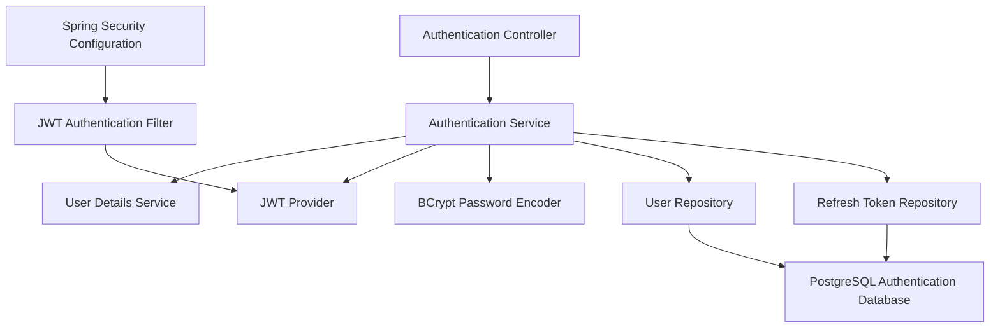

# Component Diagram

## Document Information

+----------------------+----------------------------------------------+
| Attribute            | Value                                        |
+----------------------+----------------------------------------------+
| Document Name        | Component Diagram                            |
| Project              | WorkSphere                                   |
| Version              | 1.0                                          |
| Status               | Approved                                     |
| Owner                | Bhargav Kaushik                              |
| Prepared By          | Bhargav Kaushik                              |
| Last Updated         | July 2026                                    |
+----------------------+----------------------------------------------+

---

# Table of Contents

1. Purpose
2. Scope
3. Selected Container
4. Component Overview
5. Component Responsibilities
6. Component Relationships
7. Component Diagram
8. Design Principles
9. References
10. Version History

---

# 1. Purpose

This document defines the internal structure of the Authentication Service
using the C4 Model Level 3 (Component Diagram).

The objective is to describe the major software components within the
Authentication Service, their responsibilities, and how they collaborate
to deliver secure authentication and authorization capabilities.

---

# 2. Scope

This document covers the internal design of the Authentication Service.

It includes:

- REST Controllers
- Business Services
- Security Components
- JWT Components
- Repositories
- Database Access
- Configuration Components
- Password Encryption
- Exception Handling

The internal implementation of other microservices follows a similar
architectural pattern and is therefore not repeated here.

---

# 3. Selected Container

Container

Authentication Service

Technology Stack

- Java 21
- Spring Boot 3.x
- Spring Security
- Spring Data JPA
- PostgreSQL
- JWT
- Maven

---

# 4. Component Overview

The Authentication Service is responsible for verifying user identities,
issuing authentication tokens, validating credentials, enforcing password
policies, and protecting access to secured APIs.

The service follows a layered architecture with clearly separated
responsibilities.

---

# 5. Component Responsibilities

## CMP-001 Authentication Controller

Responsibilities

- Login API
- Logout API
- Refresh Token API
- Password Reset API
- Change Password API

---

## CMP-002 Authentication Service

Responsibilities

- User Authentication
- Credential Validation
- Token Generation
- Password Verification
- Authentication Workflow

---

## CMP-003 User Details Service

Responsibilities

- Load User Information
- Load Roles
- Load Permissions

---

## CMP-004 JWT Provider

Responsibilities

- Generate JWT
- Validate JWT
- Parse Claims
- Token Expiration

---

## CMP-005 JWT Authentication Filter

Responsibilities

- Extract JWT
- Validate Token
- Build Security Context
- Reject Invalid Requests

---

## CMP-006 Password Encoder

Responsibilities

- Password Hashing
- Password Verification

Technology

- BCrypt

---

## CMP-007 Security Configuration

Responsibilities

- Configure Spring Security
- Endpoint Protection
- Filter Chain
- Authentication Manager

---

## CMP-008 User Repository

Responsibilities

- User Lookup
- Credential Retrieval
- Persistence Operations

---

## CMP-009 Refresh Token Repository

Responsibilities

- Store Refresh Tokens
- Validate Refresh Tokens
- Token Revocation

---

## CMP-010 Authentication Database

Responsibilities

- User Credentials
- Password Hashes
- Refresh Tokens
- Security Metadata

Technology

- PostgreSQL

---

# 6. Component Relationships

| Source | Relationship | Destination |
|---------|--------------|-------------|
| Authentication Controller | Calls | Authentication Service |
| Authentication Service | Uses | User Details Service |
| Authentication Service | Uses | Password Encoder |
| Authentication Service | Uses | JWT Provider |
| Authentication Service | Uses | User Repository |
| Authentication Service | Uses | Refresh Token Repository |
| JWT Filter | Uses | JWT Provider |
| User Repository | Reads/Writes | PostgreSQL |
| Refresh Token Repository | Reads/Writes | PostgreSQL |
| Security Configuration | Registers | JWT Filter |

---

# 7. Component Diagram

---

# 8. Design Principles

The Authentication Service follows these architectural principles:

- Layered Architecture
- Separation of Concerns
- Dependency Injection
- Stateless Authentication
- Security by Design
- Single Responsibility Principle
- Open/Closed Principle
- Constructor-based Dependency Injection
- Repository Pattern
- Service Layer Pattern

---

# 9. References

Related documents:

- System Architecture
- Context Diagram
- Container Diagram
- API Design
- Security Architecture
- Database Design

---

# Approval

+----------------------+----------------------------------------------+
| Role                 | Responsibility                               |
+----------------------+----------------------------------------------+
| Solution Architect   | Reviews component design                     |
| Technical Lead       | Validates implementation                     |
| Project Owner        | Maintains and approves this document         |
+----------------------+----------------------------------------------+

---

# Document Maintenance

This document shall be updated whenever the internal architecture of the
Authentication Service changes or new security components are introduced.

---

# Version History

+---------+------------+----------------------------------------------------------+-------------------+
| Version | Date       | Description                                              | Author            |
+---------+------------+----------------------------------------------------------+-------------------+
| 1.0     | July 2026  | Initial release of C4 Level 3 Component Diagram          | Bhargav Kaushik   |
+---------+------------+----------------------------------------------------------+-------------------+

---

# End of Document