# Entity Relationship Diagram (ERD)

## Document Information

+----------------------+--------------------------------------------------+
| Attribute            | Value                                            |
+----------------------+--------------------------------------------------+
| Document Name        | Entity Relationship Diagram                      |
| Project              | WorkSphere                                       |
| Version              | 1.0                                              |
| Status               | Draft                                           |
| Owner                | Bhargav Kaushik                                  |
| Prepared By          | Bhargav Kaushik                                  |
| Last Updated         | July 2026                                        |
+----------------------+--------------------------------------------------+

---

# Table of Contents

1. Purpose
2. Scope
3. ER Diagram Standards
4. ER Notation & Legend
5. System-Wide ER Overview
6. Domain ER Diagrams
   - Authentication Domain
   - User Domain
   - Organization Domain
   - Workspace Domain
   - Project Domain
   - Task Domain
   - Document Domain
   - Notification Domain
   - Analytics Domain
   - Audit Domain
7. Cross-Domain Reference Strategy
8. Relationship Matrix
9. Complete Mermaid ER Source
10. Design Notes
11. Future Evolution
12. Version History

---

# 1. Purpose

This document defines the Entity Relationship Diagram (ERD) design for
the WorkSphere platform.

The purpose of this document is to visually represent the relationships
between entities across different business domains while maintaining the
database architecture principles defined in the Database Design document.

This document serves as the bridge between:

- Database Architecture
- Domain Models
- Database Tables
- JPA Entity Design
- Flyway Migration Scripts
- Application Implementation

The ER diagrams defined in this document provide a blueprint for:

- Entity identification
- Relationship mapping
- Cardinality definition
- Data ownership understanding
- Database implementation planning

This document shall be used by:

- Database Architects
- Backend Developers
- Solution Architects
- DevOps Engineers
- QA Engineers

---

# 2. Scope

This document covers the entity relationships of all major WorkSphere
business domains.

The scope includes:

- Authentication Domain
- User Domain
- Organization Domain
- Workspace Domain
- Project Domain
- Task Domain
- Document Domain
- Notification Domain
- Analytics Domain
- Audit Domain

The document defines:

- Entity relationships
- Relationship cardinality
- Domain ownership
- Business rules affecting relationships
- Mermaid ER diagram source
- Cross-domain reference strategy

---

## Out of Scope

The following are intentionally excluded from this document:

- Physical database deployment configuration
- SQL migration scripts
- Query optimization details
- API contracts
- UI workflows
- Application service logic

These are covered in their respective documents:

- Database Design
- API Design
- UI/UX Flow
- System Architecture

---

# 3. ER Diagram Standards

WorkSphere follows enterprise ER modelling standards aligned with its
microservices and Domain-Driven Design architecture.

The following standards apply to all ER diagrams.

| Standard ID | Description |
|-------------|-------------|
| ERD-001 | Every business entity shall have a unique identifier. |
| ERD-002 | UUID shall be used as the primary key for all entities. |
| ERD-003 | Entity relationships shall follow domain ownership boundaries. |
| ERD-004 | Foreign keys shall exist only within the owning service database. |
| ERD-005 | Cross-service relationships shall use UUID references only. |
| ERD-006 | Cardinality shall be explicitly defined for every relationship. |
| ERD-007 | Business rules shall influence relationship modelling. |
| ERD-008 | ER diagrams shall remain synchronized with database design. |
| ERD-009 | Entity names shall follow database naming conventions. |
| ERD-010 | Historical and audit relationships shall preserve traceability. |

---

## ER Modelling Principles

The following principles govern entity relationship design:

### Domain Ownership

Every entity belongs to exactly one business domain.

Example:

```
Task Entity
        |
        |
Task Domain
        |
        |
task_db
```

---

### Service Boundary Isolation

Entities belonging to different services shall not have direct
database relationships.

Example:

Invalid:

```
Task Database

task
 |
 |
user_id
 |
 |
User Database
```

Valid:

```
Task Database

task
 |
 |
assignee_id (UUID)


Task Service
       |
       |
User Service API
```

---

### Relationship Consistency

All relationships must represent valid business rules.

Example:

```
Organization

1
|
|
N

Workspace
```

Meaning:

One organization can contain multiple workspaces.

---

# 4. ER Notation & Legend

WorkSphere ER diagrams use the following notation standards.

---

## Entity Representation

Each entity represents a database table.

Example:

```text
ENTITY_NAME

id UUID PK
attribute_name TYPE
created_at TIMESTAMP
```

---

## Primary Key

Notation:

```
PK
```

Example:

```
id UUID PK
```

Represents the unique identifier of an entity.

---

## Foreign Key

Notation:

```
FK
```

Example:

```
organization_id UUID FK
```

Represents a reference to another entity within the same database.

---

## Relationship Cardinality

| Symbol | Meaning |
|--------|---------|
| 1 | One instance |
| N | Many instances |
| 0..1 | Optional one |
| 0..N | Optional many |

---

## Relationship Types

### One-to-One

Example:

```
Employee

1 -------- 1

Profile Picture
```

Meaning:

One employee has one profile picture.

---

### One-to-Many

Example:

```
Project

1 -------- N

Task
```

Meaning:

One project contains many tasks.

---

### Many-to-Many

Example:

```
User

N -------- N

Role
```

Implemented using an intermediate mapping table.

Example:

```
user_role
```

---

### Self Reference

Example:

```
Employee

manager_id

Employee
```

Used for hierarchical relationships.

---

# End of Part 1

---

# 5. System-Wide ER Overview

## Overview

The WorkSphere platform consists of multiple independent business domains
aligned with the microservices architecture.

Each domain owns its entities and database schema.

The system-wide ER overview represents the logical business relationships
between major entities across the platform.

These relationships represent business associations only.

They do not represent direct database foreign keys across services.

---

## High-Level Business Relationship Model

```text
                         Organization
                              |
                              |
                              |
                    +---------+----------+
                    |                    |
                    ▼                    ▼

                 Employee            Workspace
                    |                    |
                    |                    |
                    |                    |
                    |                    ▼
                    |                Project
                    |                    |
                    |                    |
                    |                    ▼
                    |                  Task
                    |
                    |
                    |
                    ▼

              Authentication


Workspace
    |
    |
    +----------------+
    |                |
    ▼                ▼

Document         Notification


All Domains

    |
    |
    ▼

Audit


Operational Data

    |
    |
    ▼

Analytics
```

---

# 5.1 System-Wide Mermaid ER Diagram

The following diagram represents the logical relationship between
WorkSphere business domains.

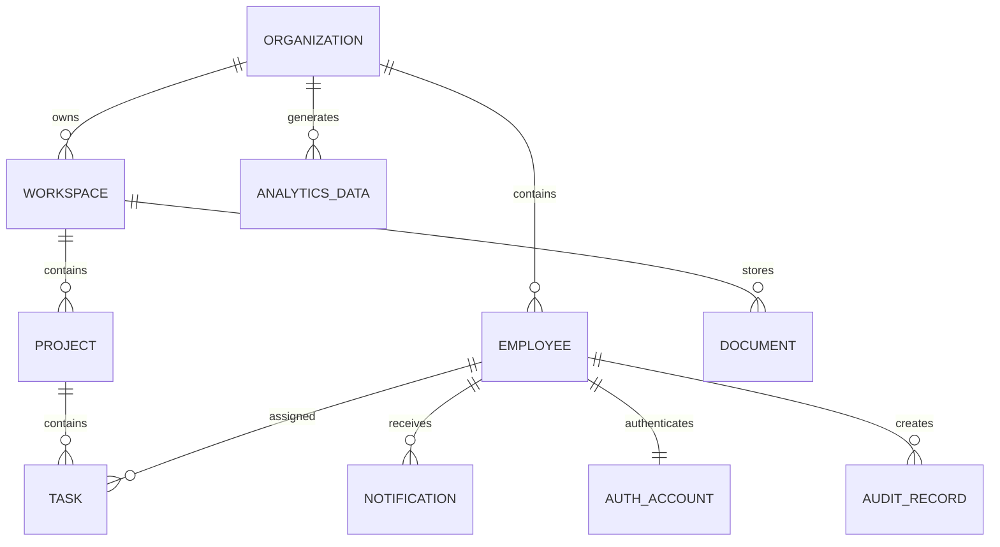

---

# 5.2 System-Wide Entity Relationship Explanation

## Organization → Employee

Relationship:

```
Organization 1 : N Employee
```

Description:

An organization contains multiple employees.

Business Rules:

- Every employee belongs to one organization.
- Employees cannot exist without an owning organization.
- Organization isolation is maintained using organization boundaries.

---

## Organization → Workspace

Relationship:

```
Organization 1 : N Workspace
```

Description:

An organization can create multiple collaboration workspaces.

Business Rules:

- Every workspace belongs to exactly one organization.
- Workspace names must be unique within an organization.
- Workspace access is controlled by membership rules.

---

## Workspace → Project

Relationship:

```
Workspace 1 : N Project
```

Description:

A workspace contains multiple projects.

Business Rules:

- Every project belongs to one workspace.
- Projects inherit organizational ownership through workspace.
- Projects cannot exist outside a workspace.

---

## Project → Task

Relationship:

```
Project 1 : N Task
```

Description:

A project contains multiple tasks.

Business Rules:

- Every task belongs to one project.
- Tasks support assignment, tracking, and workflow management.
- Task lifecycle is controlled by Task Service.

---

## Workspace → Document

Relationship:

```
Workspace 1 : N Document
```

Description:

A workspace contains multiple documents.

Business Rules:

- Documents belong to a workspace.
- File binaries are stored in MinIO.
- Database stores only document metadata.

---

## Employee → Task

Relationship:

```
Employee 1 : N Task
```

Description:

An employee may be assigned multiple tasks.

Business Rules:

- Assignment information is stored using employee UUID.
- Task Service does not store employee profile data.
- Employee information is retrieved through User Service.

---

## Employee → Notification

Relationship:

```
Employee 1 : N Notification
```

Description:

An employee can receive multiple notifications.

Business Rules:

- Notifications track delivery status.
- Delivery channels are configurable.
- User preferences control notification behavior.

---

## Employee → Authentication Account

Relationship:

```
Employee 1 : 1 Authentication Account
```

Description:

Each employee has one authentication identity.

Business Rules:

- Authentication credentials are isolated from profile data.
- Passwords are stored only in Authentication Service.
- User profile information is managed by User Service.

---

## Organization → Analytics

Relationship:

```
Organization 1 : N Analytics Data
```

Description:

Organizations generate analytical information.

Business Rules:

- Analytics data is optimized for reporting.
- Historical snapshots are immutable.
- Analytics databases are read optimized.

---

## Employee → Audit Records

Relationship:

```
Employee 1 : N Audit Records
```

Description:

Employee activities generate audit records.

Business Rules:

- Audit records are immutable.
- Security-sensitive operations must be logged.
- Audit history cannot be physically deleted.

---

# 5.3 Cross-Domain Relationship Principle

Although business relationships exist between domains, database
relationships are restricted by service ownership.

Example:

Business Relationship:

```
Task

belongs to

Project
```

Database Implementation:

```
task_db

task
----
id
project_id
```

`project_id` is stored as a UUID reference.

No foreign key exists between:

```
task_db
      |
      X
      |
project_db
```

Communication occurs through:

- REST APIs
- Domain Events
- Asynchronous Messaging

---

# 5.4 System-Wide Relationship Summary

| Source Entity | Relationship | Target Entity | Cardinality |
|---------------|--------------|---------------|-------------|
| Organization | Contains | Employee | 1:N |
| Organization | Owns | Workspace | 1:N |
| Workspace | Contains | Project | 1:N |
| Project | Contains | Task | 1:N |
| Workspace | Stores | Document | 1:N |
| Employee | Assigned | Task | 1:N |
| Employee | Receives | Notification | 1:N |
| Employee | Owns Identity | Authentication Account | 1:1 |
| Organization | Generates | Analytics Data | 1:N |
| Employee | Creates | Audit Record | 1:N |

---

# End of Part 2

---

# 6. Domain ER Diagrams

The following sections define entity relationships for each WorkSphere
business domain.

Each domain ER diagram represents:

- Database-owned entities
- Table relationships
- Cardinality
- Business rules
- Implementation considerations

Each diagram follows the Database per Service architecture.

---

# 6.1 Authentication Domain ER Diagram

## Overview

The Authentication Domain manages:

- User authentication
- Authorization
- Role management
- Permission management
- Session management
- Security controls

The Authentication Service owns:

```
auth_db
```

Authentication data is isolated from business profile data managed by
the User Domain.

---

## Entities

The Authentication Domain contains the following core entities:

| Entity | Purpose |
|--------|---------|
| user | Stores authentication identity |
| role | Defines system roles |
| permission | Defines available permissions |
| user_role | Maps users and roles |
| role_permission | Maps roles and permissions |
| refresh_token | Stores active refresh tokens |
| password_history | Maintains password history |
| login_attempt | Tracks authentication attempts |

---

# Authentication ER Diagram

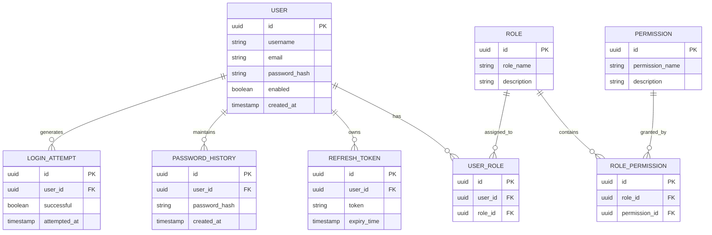

---

# Relationship Explanation

## User → User Role

Relationship:

```
USER 1 : N USER_ROLE
```

Description:

A user can have multiple role assignments.

Example:

```
Employee

 |
 |
 +---- ADMIN Role

 |
 |
 +---- PROJECT_MANAGER Role
```

Business Rules:

- A user may have multiple roles.
- Roles are assigned dynamically.
- Direct permission assignment is avoided.

---

## Role → Permission

Relationship:

```
ROLE 1 : N ROLE_PERMISSION
```

Description:

A role contains multiple permissions.

Example:

```
PROJECT_MANAGER

    |
    |
    +---- CREATE_PROJECT

    |
    |
    +---- MANAGE_TASK
```

Business Rules:

- Permissions are reusable.
- Roles define access levels.
- Authorization decisions are permission based.

---

## User → Refresh Token

Relationship:

```
USER 1 : N REFRESH_TOKEN
```

Description:

A user may have multiple active sessions.

Business Rules:

- Tokens have expiration dates.
- Expired tokens are invalidated.
- Tokens must be securely stored.

---

## User → Password History

Relationship:

```
USER 1 : N PASSWORD_HISTORY
```

Description:

Stores previous password versions.

Business Rules:

- Password reuse prevention is supported.
- Password history records are immutable.

---

## User → Login Attempt

Relationship:

```
USER 1 : N LOGIN_ATTEMPT
```

Description:

Tracks authentication attempts.

Business Rules:

- Failed attempts are recorded.
- Account lock policies use this information.
- Security events are generated when required.

---

# Authentication Domain Design Notes

| Note ID | Description |
|---------|-------------|
| AUTH-ER-001 | Authentication data is isolated from user profile data. |
| AUTH-ER-002 | Passwords are stored only as secure hashes. |
| AUTH-ER-003 | User-role and role-permission relationships use mapping tables. |
| AUTH-ER-004 | Authentication entities follow Base Entity standards. |
| AUTH-ER-005 | UUID identifiers are used for all entities. |

---

# Authentication Domain Cardinality Summary

| Relationship | Cardinality |
|--------------|-------------|
| User → User Role | 1:N |
| Role → User Role | 1:N |
| Role → Role Permission | 1:N |
| Permission → Role Permission | 1:N |
| User → Refresh Token | 1:N |
| User → Password History | 1:N |
| User → Login Attempt | 1:N |

---

# End of Authentication Domain ER Diagram

---

# End of Part 3

---

# 6.2 User Domain ER Diagram

## Overview

The User Domain manages employee profile information and user-related
business data.

This domain is separate from the Authentication Domain.

The Authentication Service manages:

- Credentials
- Passwords
- Tokens
- Roles

The User Service manages:

- Employee profile
- Personal information
- Preferences
- Profile metadata

The User Service owns:

```
user_db
```

---

## Entities

| Entity | Purpose |
|--------|---------|
| employee | Employee profile information |
| address | Employee address information |
| emergency_contact | Emergency contact details |
| user_preference | User configuration preferences |
| profile_picture | Profile image metadata |

---

# User Domain ER Diagram

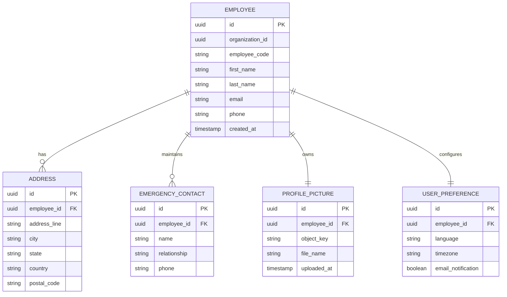

---

# Relationship Explanation

## Employee → Address

Relationship:

```
EMPLOYEE 1 : N ADDRESS
```

Description:

An employee may have multiple stored addresses.

Business Rules:

- Current and historical addresses may be maintained.
- Address information belongs only to User Service.
- Address changes are audited.

---

## Employee → Emergency Contact

Relationship:

```
EMPLOYEE 1 : N EMERGENCY_CONTACT
```

Description:

An employee may maintain multiple emergency contacts.

Business Rules:

- Contact details are private employee data.
- Access is controlled by authorization policies.

---

## Employee → Profile Picture

Relationship:

```
EMPLOYEE 1 : 1 PROFILE_PICTURE
```

Description:

Each employee can have one active profile picture.

Business Rules:

- Image binary is stored in MinIO.
- Database stores only metadata.
- Old images may be archived.

---

## Employee → User Preference

Relationship:

```
EMPLOYEE 1 : 1 USER_PREFERENCE
```

Description:

Each employee has configurable preferences.

Business Rules:

- Preferences control personalization.
- Notification settings are consumed by Notification Service.

---

# User Domain Design Notes

| Note ID | Description |
|---------|-------------|
| USER-ER-001 | Authentication information is not stored here. |
| USER-ER-002 | Employee data belongs exclusively to User Service. |
| USER-ER-003 | Profile images use MinIO object storage. |
| USER-ER-004 | Employee records contain organization reference UUID. |
| USER-ER-005 | All entities follow Base Entity standards. |

---

# User Domain Cardinality Summary

| Relationship | Cardinality |
|--------------|-------------|
| Employee → Address | 1:N |
| Employee → Emergency Contact | 1:N |
| Employee → Profile Picture | 1:1 |
| Employee → User Preference | 1:1 |

---

# 6.3 Organization Domain ER Diagram

## Overview

The Organization Domain defines the tenant structure and internal hierarchy
of WorkSphere.

This domain manages:

- Organizations
- Departments
- Teams
- Designations
- Reporting hierarchy
- Organization settings

The Organization Service owns:

```
organization_db
```

---

## Entities

| Entity | Purpose |
|--------|---------|
| organization | Tenant information |
| department | Organizational departments |
| team | Teams inside departments |
| designation | Employee job designations |
| reporting_structure | Employee hierarchy |
| organization_setting | Organization configuration |

---

# Organization Domain ER Diagram

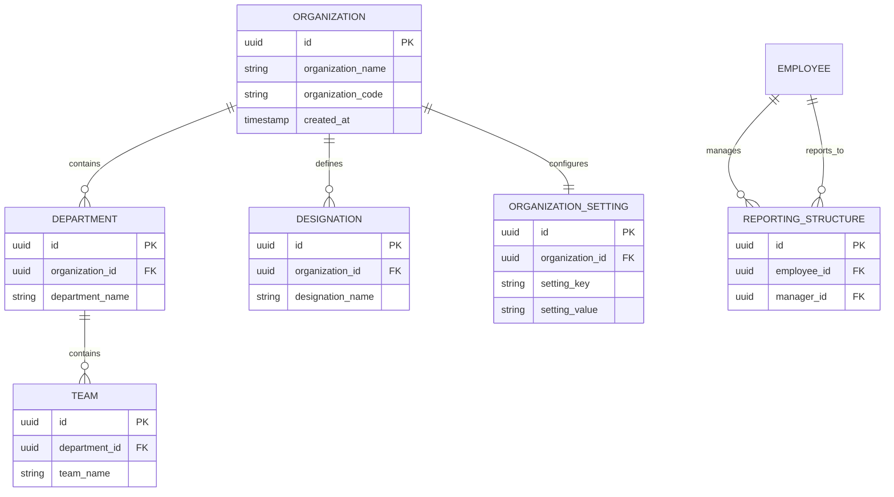

---

# Relationship Explanation

## Organization → Department

Relationship:

```
ORGANIZATION 1 : N DEPARTMENT
```

Description:

An organization contains multiple departments.

Business Rules:

- Departments cannot exist without organization ownership.
- Department names must be unique within an organization.

---

## Department → Team

Relationship:

```
DEPARTMENT 1 : N TEAM
```

Description:

Departments contain multiple teams.

Business Rules:

- Teams inherit organization ownership.
- Teams are used as collaboration boundaries.

---

## Organization → Designation

Relationship:

```
ORGANIZATION 1 : N DESIGNATION
```

Description:

Organizations define their own job designations.

Business Rules:

- Designations are tenant-specific.
- Same designation name may exist in different organizations.

---

## Organization → Organization Setting

Relationship:

```
ORGANIZATION 1 : 1 ORGANIZATION_SETTING
```

Description:

Stores organization-level configuration.

Business Rules:

- Settings are configurable.
- Sensitive settings require protection.

---

## Employee → Reporting Structure

Relationship:

```
EMPLOYEE 1 : N REPORTING_STRUCTURE
```

Description:

Maintains organizational reporting hierarchy.

Business Rules:

- Employees may report to managers.
- Circular reporting structures are prohibited.
- Hierarchy validation happens at service layer.

---

# Organization Domain Design Notes

| Note ID | Description |
|---------|-------------|
| ORG-ER-001 | Organization represents tenant boundary. |
| ORG-ER-002 | Departments belong only to one organization. |
| ORG-ER-003 | Reporting hierarchy uses self-reference. |
| ORG-ER-004 | Circular references are prohibited. |
| ORG-ER-005 | Organization isolation is mandatory. |

---

# Organization Domain Cardinality Summary

| Relationship | Cardinality |
|--------------|-------------|
| Organization → Department | 1:N |
| Department → Team | 1:N |
| Organization → Designation | 1:N |
| Organization → Setting | 1:1 |
| Employee → Reporting Structure | 1:N |

---

# End of Organization Domain ER Diagram

---

# End of Part 4

---

# 6.4 Workspace Domain ER Diagram

## Overview

The Workspace Domain represents collaboration spaces within an
organization.

A workspace acts as the central collaboration boundary where employees
manage:

- Projects
- Documents
- Activities
- Team collaboration

The Workspace Service owns:

```
workspace_db
```

---

## Entities

| Entity | Purpose |
|--------|---------|
| workspace | Workspace master information |
| workspace_member | User membership mapping |
| workspace_role | Workspace-specific roles |
| workspace_invitation | Pending invitations |
| workspace_setting | Workspace configuration |
| workspace_activity | Workspace activity history |

---

# Workspace Domain ER Diagram

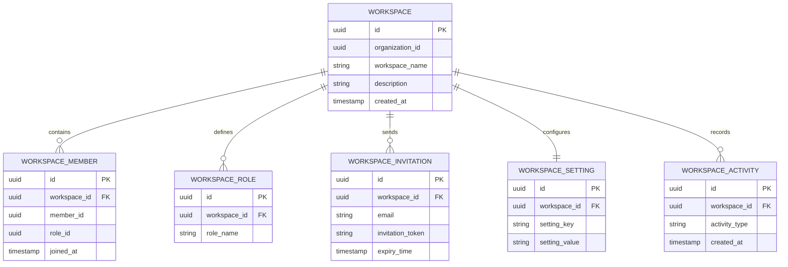

---

# Relationship Explanation

## Workspace → Workspace Member

Relationship:

```
WORKSPACE 1 : N WORKSPACE_MEMBER
```

Description:

A workspace can have multiple members.

Business Rules:

- Users may belong to multiple workspaces.
- Membership is controlled through roles.
- Member access is validated by Workspace Service.

---

## Workspace → Workspace Role

Relationship:

```
WORKSPACE 1 : N WORKSPACE_ROLE
```

Description:

Each workspace can define custom roles.

Business Rules:

- Workspace roles are independent from system roles.
- Permissions are managed within workspace context.

---

## Workspace → Invitation

Relationship:

```
WORKSPACE 1 : N WORKSPACE_INVITATION
```

Description:

Stores pending workspace invitations.

Business Rules:

- Invitations expire after configured duration.
- Invalid invitations cannot be accepted.
- Invitation tokens must be protected.

---

## Workspace → Workspace Setting

Relationship:

```
WORKSPACE 1 : 1 WORKSPACE_SETTING
```

Description:

Stores workspace-level configuration.

Business Rules:

- Settings are configurable.
- Changes are tracked through audit events.

---

## Workspace → Activity

Relationship:

```
WORKSPACE 1 : N WORKSPACE_ACTIVITY
```

Description:

Maintains workspace activity history.

Business Rules:

- Activities are append-only.
- Historical records support auditing.

---

# Workspace Domain Design Notes

| Note ID | Description |
|---------|-------------|
| WS-ER-001 | Workspace belongs to exactly one organization. |
| WS-ER-002 | Workspace membership supports multiple users. |
| WS-ER-003 | Workspace roles are separate from authentication roles. |
| WS-ER-004 | Activity records maintain collaboration history. |
| WS-ER-005 | External users are referenced using UUID values. |

---

# Workspace Domain Cardinality Summary

| Relationship | Cardinality |
|--------------|-------------|
| Workspace → Member | 1:N |
| Workspace → Role | 1:N |
| Workspace → Invitation | 1:N |
| Workspace → Setting | 1:1 |
| Workspace → Activity | 1:N |

---

# 6.5 Project Domain ER Diagram

## Overview

The Project Domain manages project planning and execution.

Projects represent structured work inside WorkSpaces.

The Project Service owns:

```
project_db
```

The domain manages:

- Projects
- Members
- Milestones
- Sprints
- Templates
- Activities

---

## Entities

| Entity | Purpose |
|--------|---------|
| project | Project master |
| project_member | Project membership |
| milestone | Project milestones |
| sprint | Sprint planning |
| project_template | Reusable project templates |
| project_activity | Project history |

---

# Project Domain ER Diagram

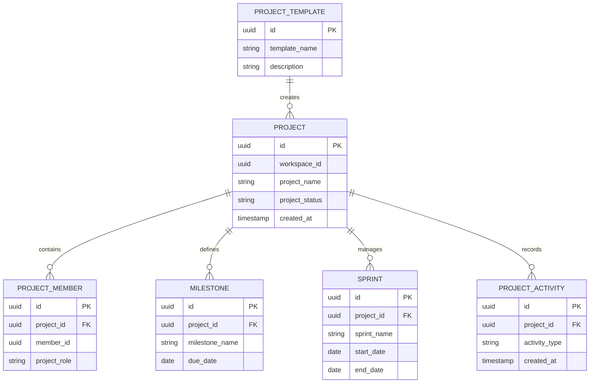

---

# Relationship Explanation

## Project → Project Member

Relationship:

```
PROJECT 1 : N PROJECT_MEMBER
```

Description:

A project contains multiple members.

Business Rules:

- Members are referenced using UUID.
- Project membership is independent from workspace membership.
- Project roles control project-level access.

---

## Project → Milestone

Relationship:

```
PROJECT 1 : N MILESTONE
```

Description:

Projects contain multiple milestones.

Business Rules:

- Milestones represent major delivery points.
- Milestone completion contributes to project progress.

---

## Project → Sprint

Relationship:

```
PROJECT 1 : N SPRINT
```

Description:

Projects may contain multiple development sprints.

Business Rules:

- Sprint lifecycle is managed by Project Service.
- Sprint dates must remain valid.

---

## Project → Activity

Relationship:

```
PROJECT 1 : N PROJECT_ACTIVITY
```

Description:

Stores project history.

Business Rules:

- Activity records are append-only.
- Used for tracking project changes.

---

## Project Template → Project

Relationship:

```
PROJECT_TEMPLATE 1 : N PROJECT
```

Description:

A template can create multiple projects.

Business Rules:

- Templates provide reusable structures.
- Template changes do not modify existing projects.

---

# Project Domain Design Notes

| Note ID | Description |
|---------|-------------|
| PROJ-ER-001 | Project belongs to one workspace. |
| PROJ-ER-002 | Project members are stored separately. |
| PROJ-ER-003 | Milestones belong only to one project. |
| PROJ-ER-004 | Activities maintain project history. |
| PROJ-ER-005 | Project references external users using UUID. |

---

# Project Domain Cardinality Summary

| Relationship | Cardinality |
|--------------|-------------|
| Project → Member | 1:N |
| Project → Milestone | 1:N |
| Project → Sprint | 1:N |
| Project → Activity | 1:N |
| Template → Project | 1:N |

---

# End of Project Domain ER Diagram

---

# End of Part 5

---

# 6.6 Task Domain ER Diagram

## Overview

The Task Domain manages all operational work items inside WorkSphere.

It is one of the core execution domains of the platform and handles:

- Task creation
- Assignment
- Status tracking
- Comments
- Attachments
- Labels
- Checklists
- Dependencies
- Task history

The Task Service owns:

```
task_db
```

---

## Entities

| Entity | Purpose |
|--------|---------|
| task | Main work item |
| task_comment | Task discussions |
| task_attachment | Task file references |
| task_label | Task categorization |
| task_history | Task change tracking |
| task_checklist | Checklist items |
| task_dependency | Task relationships |

---

# Task Domain ER Diagram

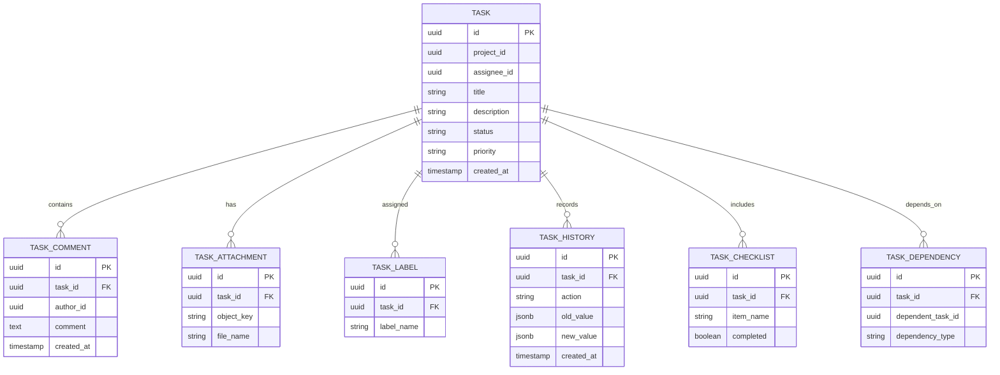

---

# Relationship Explanation

## Task → Task Comment

Relationship:

```
TASK 1 : N TASK_COMMENT
```

Description:

A task can contain multiple comments.

Business Rules:

- Comments preserve collaboration history.
- Comments are associated with task lifecycle.
- Author information is referenced through UUID.

---

## Task → Task Attachment

Relationship:

```
TASK 1 : N TASK_ATTACHMENT
```

Description:

Tasks can have multiple attachments.

Business Rules:

- Files are stored in MinIO.
- Database stores only metadata.
- Attachment deletion follows soft delete policy.

---

## Task → Task Label

Relationship:

```
TASK 1 : N TASK_LABEL
```

Description:

Tasks can contain multiple labels.

Business Rules:

- Labels improve task organization.
- Labels are managed within Task Service.

---

## Task → Task History

Relationship:

```
TASK 1 : N TASK_HISTORY
```

Description:

Maintains complete task modification history.

Business Rules:

- History records are immutable.
- Every important state change creates a history entry.

---

## Task → Checklist

Relationship:

```
TASK 1 : N TASK_CHECKLIST
```

Description:

A task may contain multiple checklist items.

Business Rules:

- Checklist completion contributes to task progress.
- Checklist items belong only to their parent task.

---

## Task Dependency

Relationship:

```
TASK 1 : N TASK_DEPENDENCY
```

Description:

Represents dependency between tasks.

Business Rules:

- Circular dependencies are prohibited.
- Dependency validation happens at service level.

---

# Task Domain Design Notes

| Note ID | Description |
|---------|-------------|
| TASK-ER-001 | Task belongs to exactly one project. |
| TASK-ER-002 | Task history is immutable. |
| TASK-ER-003 | Attachments use MinIO storage. |
| TASK-ER-004 | External user references use UUID only. |
| TASK-ER-005 | Dependency cycles are prohibited. |

---

# Task Domain Cardinality Summary

| Relationship | Cardinality |
|--------------|-------------|
| Task → Comment | 1:N |
| Task → Attachment | 1:N |
| Task → Label | 1:N |
| Task → History | 1:N |
| Task → Checklist | 1:N |
| Task → Dependency | 1:N |

---

# 6.7 Document Domain ER Diagram

## Overview

The Document Domain manages digital assets within WorkSphere.

The domain handles:

- Documents
- Folders
- Versions
- Permissions
- Tags
- Document activities

Actual file content is stored in:

```
MinIO Object Storage
```

The database stores metadata only.

The Document Service owns:

```
document_db
```

---

## Entities

| Entity | Purpose |
|--------|---------|
| document | Document metadata |
| folder | Folder hierarchy |
| document_version | Version management |
| document_permission | Sharing permissions |
| document_tag | Document categorization |
| document_activity | Document history |

---

# Document Domain ER Diagram

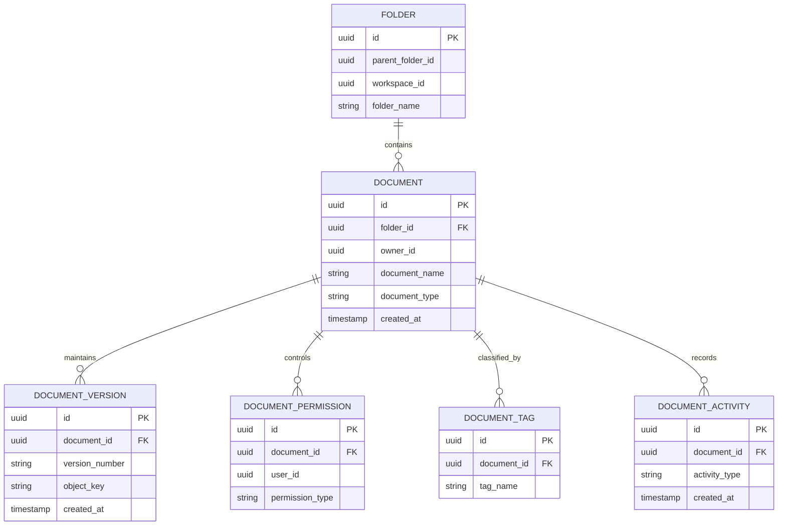

---

# Relationship Explanation

## Folder → Document

Relationship:

```
FOLDER 1 : N DOCUMENT
```

Description:

A folder can contain multiple documents.

Business Rules:

- Folder hierarchy supports nested structures.
- Documents belong to one workspace.

---

## Document → Version

Relationship:

```
DOCUMENT 1 : N DOCUMENT_VERSION
```

Description:

Every document can have multiple versions.

Business Rules:

- Each modification creates a new version.
- Previous versions remain available.

---

## Document → Permission

Relationship:

```
DOCUMENT 1 : N DOCUMENT_PERMISSION
```

Description:

Documents can have multiple access rules.

Business Rules:

- Permissions define sharing access.
- Authorization is validated by Document Service.

---

## Document → Tag

Relationship:

```
DOCUMENT 1 : N DOCUMENT_TAG
```

Description:

Documents can have multiple tags.

Business Rules:

- Tags improve searchability.
- AI tagging can be introduced later.

---

## Document → Activity

Relationship:

```
DOCUMENT 1 : N DOCUMENT_ACTIVITY
```

Description:

Tracks document operations.

Business Rules:

- Activities are append-only.
- Used for auditing and analytics.

---

# Document Domain Design Notes

| Note ID | Description |
|---------|-------------|
| DOC-ER-001 | Document metadata is stored in PostgreSQL. |
| DOC-ER-002 | File binaries are stored in MinIO. |
| DOC-ER-003 | Every update creates a document version. |
| DOC-ER-004 | Folder hierarchy supports nesting. |
| DOC-ER-005 | Permissions are managed at document level. |

---

# Document Domain Cardinality Summary

| Relationship | Cardinality |
|--------------|-------------|
| Folder → Document | 1:N |
| Document → Version | 1:N |
| Document → Permission | 1:N |
| Document → Tag | 1:N |
| Document → Activity | 1:N |

---

# End of Document Domain ER Diagram

---

# End of Part 6

---

# 6.8 Notification Domain ER Diagram

## Overview

The Notification Domain manages all communication events generated by
WorkSphere.

It provides a centralized notification mechanism supporting:

- In-app notifications
- Email notifications
- Push notifications
- Delivery tracking
- Notification preferences
- Message templates

The Notification Service owns:

```
notification_db
```

---

## Entities

| Entity | Purpose |
|--------|---------|
| notification | Notification record |
| notification_template | Message templates |
| notification_delivery | Delivery tracking |
| notification_preference | User notification settings |
| notification_queue | Pending notifications |

---

# Notification Domain ER Diagram

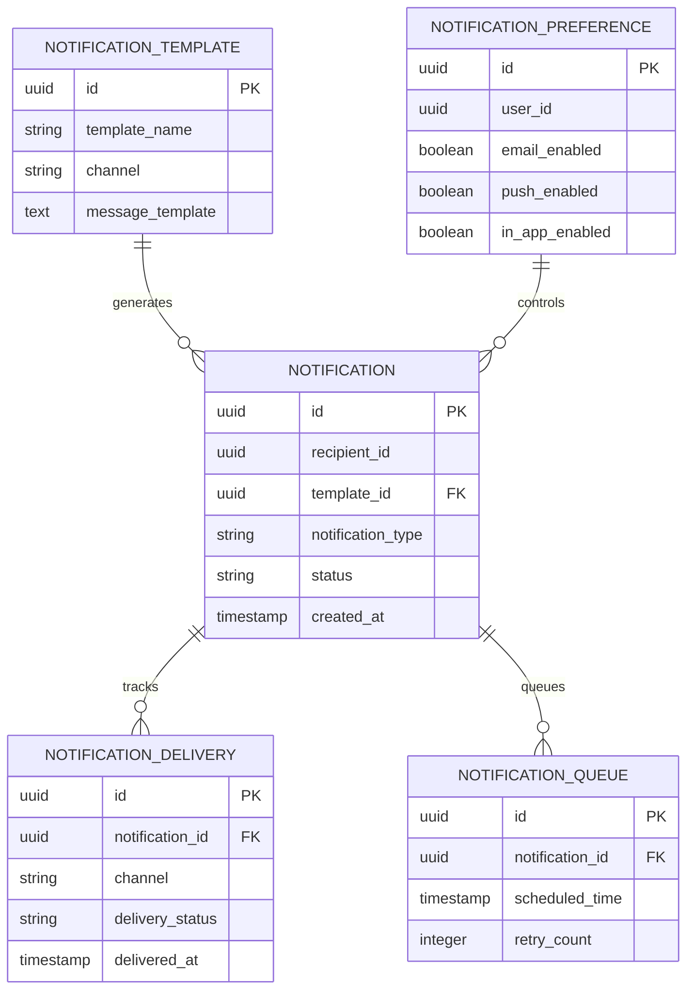

---

# Relationship Explanation

## Notification Template → Notification

Relationship:

```
TEMPLATE 1 : N NOTIFICATION
```

Description:

A template can generate multiple notifications.

Business Rules:

- Templates support reusable messages.
- Template changes affect future notifications only.

---

## Notification → Delivery

Relationship:

```
NOTIFICATION 1 : N DELIVERY
```

Description:

Tracks delivery attempts across channels.

Business Rules:

- Failed deliveries can be retried.
- Delivery status is maintained for auditing.

---

## Notification → Queue

Relationship:

```
NOTIFICATION 1 : N QUEUE
```

Description:

Stores scheduled or pending notifications.

Business Rules:

- Queue processing is asynchronous.
- Retry mechanism handles failures.

---

## Preference → Notification

Relationship:

```
PREFERENCE 1 : N NOTIFICATION
```

Description:

User preferences determine notification delivery behavior.

Business Rules:

- User preferences override system defaults.
- Disabled channels are skipped.

---

# Notification Domain Design Notes

| Note ID | Description |
|---------|-------------|
| NOTI-ER-001 | Notifications are generated asynchronously. |
| NOTI-ER-002 | Delivery attempts are tracked. |
| NOTI-ER-003 | Preferences control notification channels. |
| NOTI-ER-004 | Templates support dynamic placeholders. |
| NOTI-ER-005 | Failed deliveries support retries. |

---

# Notification Domain Cardinality Summary

| Relationship | Cardinality |
|--------------|-------------|
| Template → Notification | 1:N |
| Notification → Delivery | 1:N |
| Notification → Queue | 1:N |
| Preference → Notification | 1:N |

---

# 6.9 Analytics Domain ER Diagram

## Overview

The Analytics Domain provides reporting, dashboards, and business insights
for WorkSphere.

Unlike transactional databases, this database is optimized for:

- Aggregation
- Reporting
- Historical analysis
- KPI monitoring

The Analytics Service owns:

```
analytics_db
```

---

## Entities

| Entity | Purpose |
|--------|---------|
| dashboard | Dashboard configuration |
| dashboard_widget | Dashboard components |
| report | Generated reports |
| metric | Business metrics |
| analytics_snapshot | Historical data |

---

# Analytics Domain ER Diagram

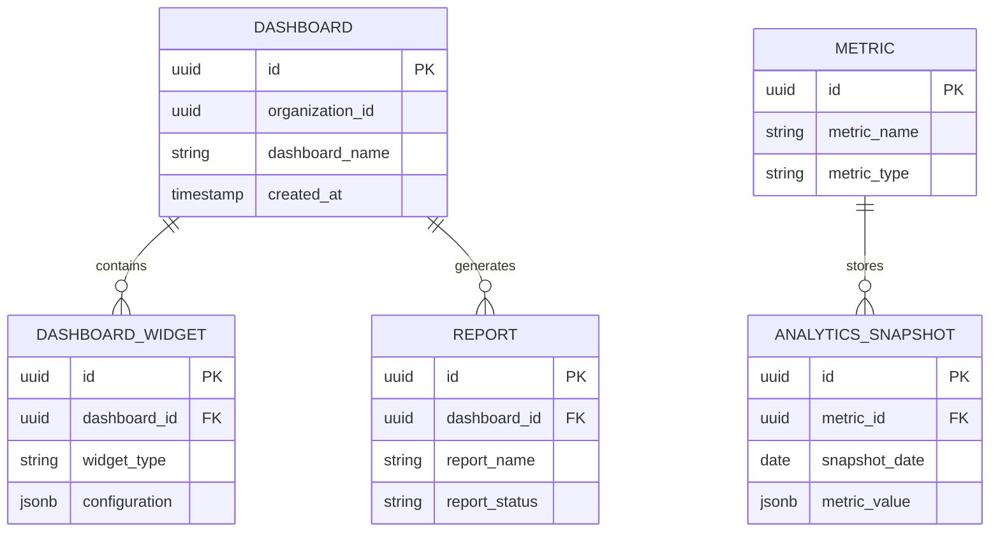

---

# Relationship Explanation

## Dashboard → Widget

Relationship:

```
DASHBOARD 1 : N WIDGET
```

Description:

A dashboard consists of multiple widgets.

Business Rules:

- Widgets are configurable.
- Each widget represents analytical data.

---

## Dashboard → Report

Relationship:

```
DASHBOARD 1 : N REPORT
```

Description:

Dashboards can generate multiple reports.

Business Rules:

- Reports may be generated asynchronously.
- Generated reports are immutable.

---

## Metric → Snapshot

Relationship:

```
METRIC 1 : N SNAPSHOT
```

Description:

Metrics maintain historical values.

Business Rules:

- Snapshots are append-only.
- Historical analytics remain unchanged.

---

# Analytics Domain Design Notes

| Note ID | Description |
|---------|-------------|
| ANA-ER-001 | Analytics database is read optimized. |
| ANA-ER-002 | Historical snapshots are immutable. |
| ANA-ER-003 | KPI data is organization specific. |
| ANA-ER-004 | Reports are generated asynchronously. |

---

# Analytics Domain Cardinality Summary

| Relationship | Cardinality |
|--------------|-------------|
| Dashboard → Widget | 1:N |
| Dashboard → Report | 1:N |
| Metric → Snapshot | 1:N |

---

# 6.10 Audit Domain ER Diagram

## Overview

The Audit Domain provides centralized tracking of security,
operational, and compliance-related activities.

Audit data is immutable and supports:

- Security investigation
- Compliance requirements
- User accountability
- Operational monitoring

The Audit Service owns:

```
audit_db
```

---

## Entities

| Entity | Purpose |
|--------|---------|
| audit_log | General audit records |
| activity_log | User activities |
| login_history | Authentication history |
| security_event | Security incidents |
| system_event | Platform events |

---

# Audit Domain ER Diagram

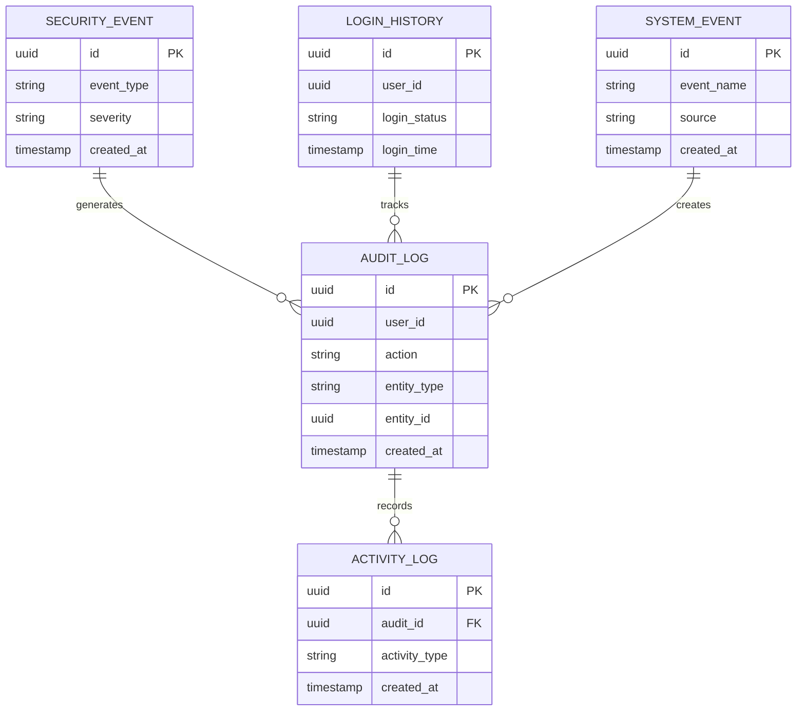

---

# Relationship Explanation

## Audit Log → Activity Log

Relationship:

```
AUDIT_LOG 1 : N ACTIVITY_LOG
```

Description:

Stores detailed user activity records.

Business Rules:

- Audit information is immutable.
- Records cannot be modified.

---

## Security Event → Audit Log

Relationship:

```
SECURITY_EVENT 1 : N AUDIT_LOG
```

Description:

Security incidents generate audit records.

Business Rules:

- Every security event must be logged.
- Security events support investigations.

---

## Login History → Audit Log

Relationship:

```
LOGIN_HISTORY 1 : N AUDIT_LOG
```

Description:

Authentication activities are tracked.

Business Rules:

- Login attempts are retained according to policy.
- Failed attempts are recorded.

---

## System Event → Audit Log

Relationship:

```
SYSTEM_EVENT 1 : N AUDIT_LOG
```

Description:

Platform-level events are audited.

Business Rules:

- System activities are traceable.
- Operational events support monitoring.

---

# Audit Domain Design Notes

| Note ID | Description |
|---------|-------------|
| AUD-ER-001 | Audit records are immutable. |
| AUD-ER-002 | Security events require audit entries. |
| AUD-ER-003 | Audit retention follows compliance rules. |
| AUD-ER-004 | Physical deletion is prohibited. |

---

# Audit Domain Cardinality Summary

| Relationship | Cardinality |
|--------------|-------------|
| Audit Log → Activity Log | 1:N |
| Security Event → Audit Log | 1:N |
| Login History → Audit Log | 1:N |
| System Event → Audit Log | 1:N |

---

# End of Part 7

---

# 7. Cross-Domain Reference Strategy

## Overview

WorkSphere follows a microservices architecture where each domain owns its
database independently.

Because databases are isolated, relationships between different domains are
not implemented using foreign keys.

Instead, external references are maintained using UUID values and validated
through service communication.

---

# Cross-Domain Relationship Principles

| Principle ID | Description |
|-------------|-------------|
| CDS-001 | Cross-domain foreign keys are prohibited. |
| CDS-002 | External entities are referenced using UUID values. |
| CDS-003 | Data ownership remains with the owning service. |
| CDS-004 | Validation occurs through APIs or events. |
| CDS-005 | Services must avoid direct database dependency. |

---

# External Reference Examples

## Project → Workspace

Project Service stores:

```
project
---------
id
workspace_id
project_name
```

Relationship:

```
Project Service
        |
        |
        ▼

Workspace Service
```

Implementation:

- `workspace_id` is stored as UUID.
- Workspace existence is validated through Workspace API.
- No database foreign key exists.

---

## Task → Project

Task Service stores:

```
task
---------
id
project_id
title
status
```

Relationship:

```
Task Service
        |
        |
        ▼

Project Service
```

Rules:

- Task database does not access project database.
- Project validation happens through Project API/events.

---

## Task → User

Task Service stores:

```
task
---------
assignee_id
reporter_id
```

Relationship:

```
Task Service
        |
        |
        ▼

User Service
```

Rules:

- User information is retrieved through User Service.
- Only UUID references are maintained.

---

## Document → Workspace

Document Service stores:

```
document
---------
workspace_id
owner_id
```

Rules:

- Workspace ownership is validated through Workspace Service.
- Owner information comes from User Service.

---

# Cross-Service Relationship Map

```text
Organization Service
        |
        |
        +---------------- User Service
        |
        |
        +---------------- Workspace Service
                              |
                              |
                              +---------------- Project Service
                                                     |
                                                     |
                                                     +---------------- Task Service


Workspace Service
        |
        |
        +---------------- Document Service


All Services
        |
        |
        +---------------- Notification Service


All Services
        |
        |
        +---------------- Audit Service


All Services
        |
        |
        +---------------- Analytics Service
```

---

# 8. Complete System ER Overview

## Purpose

This diagram provides a high-level representation of the complete WorkSphere
business data ecosystem.

It does not represent physical database relationships.

It represents:

- Business ownership
- Domain interaction
- Data flow
- Entity dependency

---

# System-Level Domain ER Diagram

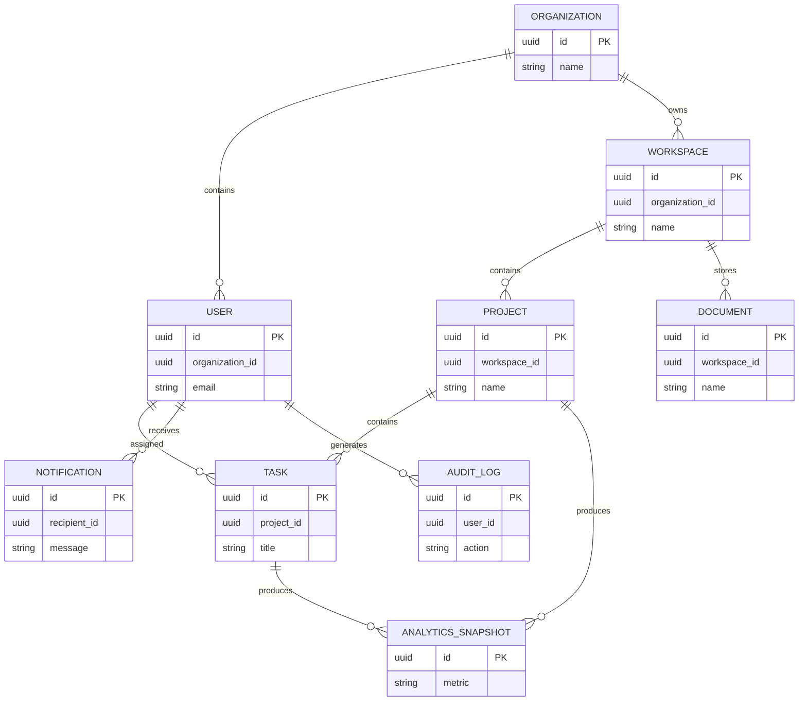

---

# System-Level Relationship Explanation

## Organization → User

Relationship:

```
Organization 1 : N User
```

Description:

An organization contains multiple employees.

---

## Organization → Workspace

Relationship:

```
Organization 1 : N Workspace
```

Description:

Organizations create multiple collaboration spaces.

---

## Workspace → Project

Relationship:

```
Workspace 1 : N Project
```

Description:

Projects are executed inside workspaces.

---

## Project → Task

Relationship:

```
Project 1 : N Task
```

Description:

Tasks represent execution units inside projects.

---

## Workspace → Document

Relationship:

```
Workspace 1 : N Document
```

Description:

Documents belong to collaboration spaces.

---

## User → Notification

Relationship:

```
User 1 : N Notification
```

Description:

Users receive platform notifications.

---

## User → Audit Log

Relationship:

```
User 1 : N Audit Log
```

Description:

User actions are tracked for accountability.

---

# 9. Relationship Matrix

The following matrix summarizes important relationships across the platform.

| Source Entity | Target Entity | Type | Ownership |
|--------------|--------------|------|-----------|
| Organization | User | 1:N | Organization Service |
| Organization | Workspace | 1:N | Organization Service |
| Workspace | Project | 1:N | Workspace Service |
| Project | Task | 1:N | Project Service |
| Workspace | Document | 1:N | Workspace Service |
| User | Notification | 1:N | Notification Service |
| User | Audit Log | 1:N | Audit Service |
| Project | Analytics | 1:N | Analytics Service |
| Task | Analytics | 1:N | Analytics Service |

---

# 10. Mermaid Diagram Standards

All ER diagrams in WorkSphere follow these standards:

| Standard | Rule |
|----------|------|
| Naming | Uppercase entity names |
| Primary Keys | Marked using PK |
| Foreign Keys | Marked using FK |
| Identifiers | UUID based |
| Relationship Style | Mermaid erDiagram |
| Cardinality | Explicitly defined |
| Ownership | Maintained by service boundary |

---

# 11. Implementation Mapping

The ER design directly supports implementation activities.

## JPA Entity Generation

Each entity becomes:

```
@Entity
@Table(name="entity_name")
```

Example:

```
Task
 |
 ▼

task table
```

---

## Flyway Migration

Every database will contain migrations:

Example:

```
db/migration

V1__create_task_table.sql
V2__create_task_history_table.sql
V3__add_indexes.sql
```

---

## API Design Alignment

Relationships influence API contracts.

Example:

Task API:

```
GET /tasks/{id}
```

returns:

```json
{
 "id":"uuid",
 "projectId":"uuid",
 "assigneeId":"uuid",
 "status":"IN_PROGRESS"
}
```

---

# 12. Future Evolution

The ER architecture supports future enhancements:

## Advanced Features

- AI-powered recommendations
- Enterprise search
- Workflow automation
- Real-time collaboration
- Data warehouse integration
- Machine learning analytics

---

## Scalability Improvements

Future options:

- Database sharding
- Read replicas
- Event sourcing
- CQRS
- Dedicated analytics warehouse

---

# 13. Final Design Summary

The WorkSphere ER architecture follows:

- Domain Driven Design
- Database per Service
- Microservice ownership boundaries
- UUID based identification
- API based relationships
- Event-driven synchronization
- Enterprise auditability

The ER model provides the foundation for:

- JPA entity development
- Flyway migrations
- API implementation
- Testing strategy
- Deployment architecture

---

# Version History

| Version | Date | Description | Author |
|---------|------|-------------|--------|
| 1.0 | July 2026 | Initial ER Diagram Design | Bhargav Kaushik |

---

# End of Document