# Sequence Diagrams

## Document Information

| Attribute | Value |
|-----------|-------|
| Document Name | Sequence Diagrams |
| Project | WorkSphere |
| Version | 1.0 |
| Status | Draft |
| Owner | Bhargav Kaushik |
| Prepared By | Bhargav Kaushik |
| Last Updated | July 2026 |

---

# Table of Contents

1. Purpose
2. Scope
3. Sequence Diagram Standards
4. System Actors and Components
5. Authentication Flow
6. Authorization Flow
7. User Registration Flow
8. Workspace Creation Flow
9. Project Creation Flow
10. Task Creation Flow
11. Task Assignment Flow
12. Document Upload Flow
13. Notification Flow
14. Audit Logging Flow
15. Event Driven Communication Flow
16. Error Handling Flow
17. Future Enhancements
18. Version History

---

# 1. Purpose

This document defines the runtime interaction behavior of the WorkSphere
platform using sequence diagrams.

It describes how users, frontend applications, API Gateway,
microservices, databases, external systems, and messaging infrastructure
communicate during important business operations.

The purpose of this document is to provide:

- Clear understanding of system execution flow
- Communication patterns between services
- API interaction reference
- Event-driven workflow documentation
- Implementation guidance for developers

This document acts as a bridge between:

- System Architecture
- API Design
- Database Design
- Backend Implementation

---

# 2. Scope

This document covers sequence diagrams for:

- User authentication
- Authorization validation
- User management
- Workspace operations
- Project operations
- Task lifecycle
- Document management
- Notification processing
- Audit logging
- Event communication

---

# 3. Sequence Diagram Standards

WorkSphere uses Mermaid sequence diagrams.

All diagrams follow:

- Clear actor identification
- Service boundary visibility
- Database interaction visibility
- External system identification
- Event communication representation

---

## Diagram Notation

| Symbol | Meaning |
|--------|---------|
| Actor | External user/system |
| Service | Microservice component |
| Database | Persistent storage |
| Queue/Event Bus | Async communication |
| API Gateway | Entry point |

---

# 4. System Actors and Components

## External Actors

| Actor | Responsibility |
|-------|----------------|
| User | Uses WorkSphere application |
| Admin | Manages organization resources |
| Manager | Manages teams and projects |
| Employee | Performs assigned work |

---

## System Components

| Component | Responsibility |
|-----------|----------------|
| Frontend Application | User interface |
| API Gateway | Request routing and security |
| Authentication Service | Identity verification |
| User Service | Employee profiles |
| Organization Service | Enterprise structure |
| Workspace Service | Collaboration spaces |
| Project Service | Project management |
| Task Service | Work management |
| Document Service | File management |
| Notification Service | Communication |
| Audit Service | Activity tracking |
| Kafka | Event communication |
| PostgreSQL | Data persistence |
| Redis | Caching |
| MinIO | Object storage |

---

# 5. Authentication Flow

## Overview

The authentication flow describes how a user logs into WorkSphere.

Components involved:

- Frontend Application
- API Gateway
- Authentication Service
- Auth Database
- Audit Service

---

## Sequence Diagram

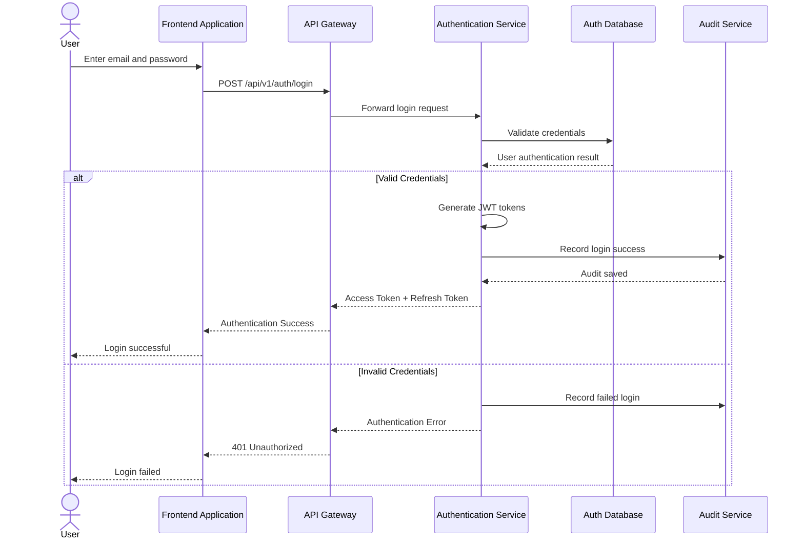

---

# Authentication Flow Explanation

1. User enters login credentials.
2. Frontend sends authentication request.
3. API Gateway validates request format.
4. Authentication Service verifies credentials.
5. Authentication Service generates JWT tokens.
6. Successful login event is recorded.
7. Tokens are returned to the client.

---

# Authentication Business Rules

| Rule ID | Description |
|---------|-------------|
| SEQ-AUTH-001 | Password validation happens only inside Authentication Service. |
| SEQ-AUTH-002 | Passwords are never exposed outside auth boundary. |
| SEQ-AUTH-003 | Login activities are audited. |
| SEQ-AUTH-004 | Invalid attempts are tracked. |

---

# End of Part 1

---

# 6. Authorization Flow

## Overview

Authorization determines whether an authenticated user has permission to
perform a requested operation.

WorkSphere follows Role Based Access Control (RBAC).

Components involved:

- Frontend Application
- API Gateway
- Authentication Service
- Authorization Layer
- Target Microservice

---

## Sequence Diagram

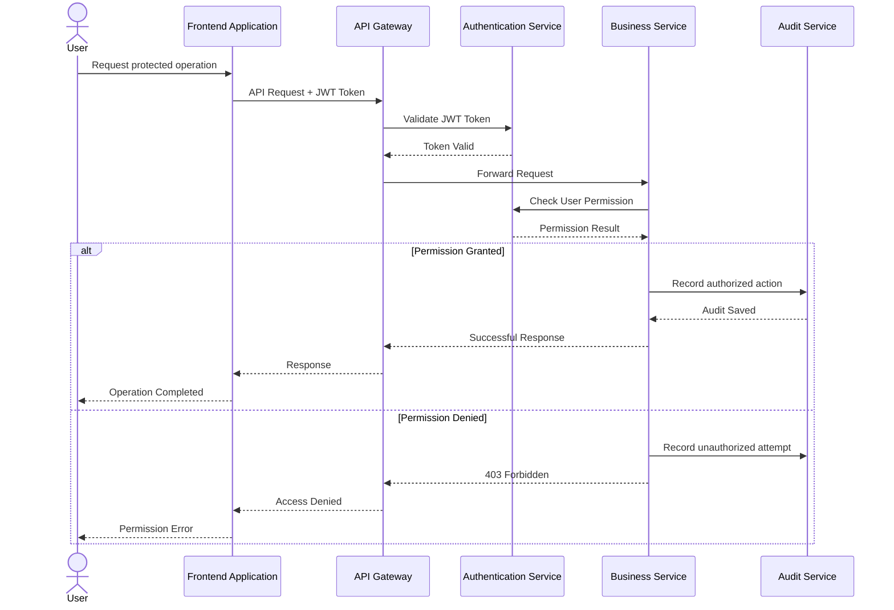

---

# Authorization Flow Explanation

1. User sends a request with JWT token.
2. API Gateway validates authentication.
3. Target service checks required permissions.
4. Authorization service validates roles and permissions.
5. Approved requests continue execution.
6. Denied requests are rejected and audited.

---

# Authorization Business Rules

| Rule ID | Description |
|---------|-------------|
| SEQ-AUTHZ-001 | Authentication must complete before authorization. |
| SEQ-AUTHZ-002 | Permissions are evaluated at service boundary. |
| SEQ-AUTHZ-003 | Unauthorized activities are logged. |

---

# 7. User Registration Flow

## Overview

This flow describes onboarding a new employee into WorkSphere.

Components involved:

- Organization Service
- User Service
- Authentication Service
- Audit Service

---

## Sequence Diagram

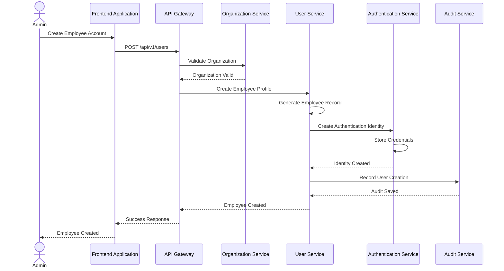

---

# User Registration Rules

| Rule ID | Description |
|---------|-------------|
| SEQ-USER-001 | Authentication data is stored separately from profile data. |
| SEQ-USER-002 | Employee profile belongs to organization. |
| SEQ-USER-003 | User creation is audited. |

---

# 8. Workspace Creation Flow

## Overview

A workspace provides a collaboration area where teams manage projects,
documents, and activities.

Components involved:

- Workspace Service
- Organization Service
- User Service
- Audit Service

---

## Sequence Diagram

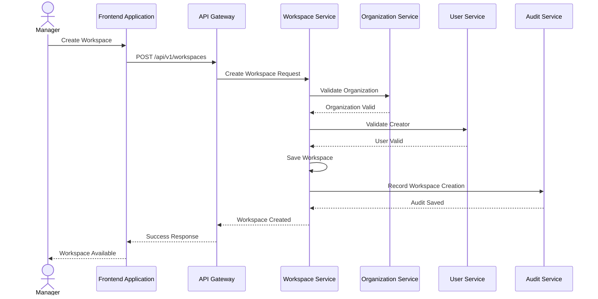

---

# Workspace Creation Rules

| Rule ID | Description |
|---------|-------------|
| SEQ-WS-001 | Workspace belongs to one organization. |
| SEQ-WS-002 | Creator becomes workspace administrator. |
| SEQ-WS-003 | Creation activity is audited. |

---

# End of Part 2

---

# 9. Project Creation Flow

## Overview

The Project Creation Flow describes how a manager creates a new project
inside a workspace.

Components involved:

- Workspace Service
- Project Service
- User Service
- Audit Service

---

## Sequence Diagram

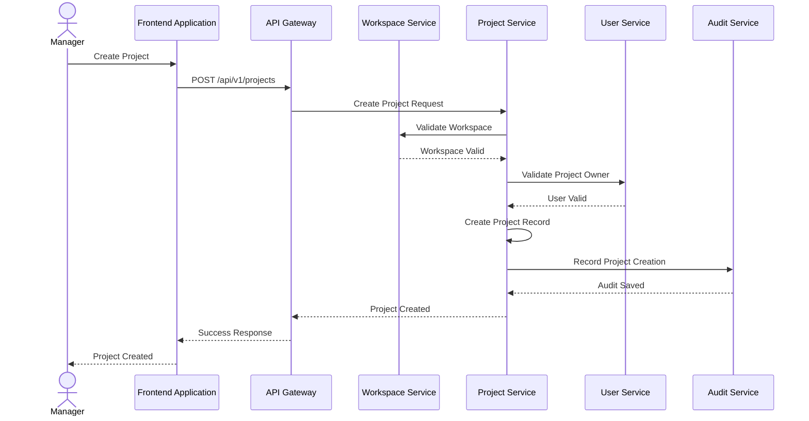

---

# Project Creation Rules

| Rule ID | Description |
|---------|-------------|
| SEQ-PROJ-001 | Project must belong to an existing workspace. |
| SEQ-PROJ-002 | Project owner must be a valid user. |
| SEQ-PROJ-003 | Project creation must be audited. |

---

# 10. Task Creation Flow

## Overview

The Task Creation Flow describes creation of a work item inside a project.

Components involved:

- Project Service
- Task Service
- Notification Service
- Audit Service

---

## Sequence Diagram

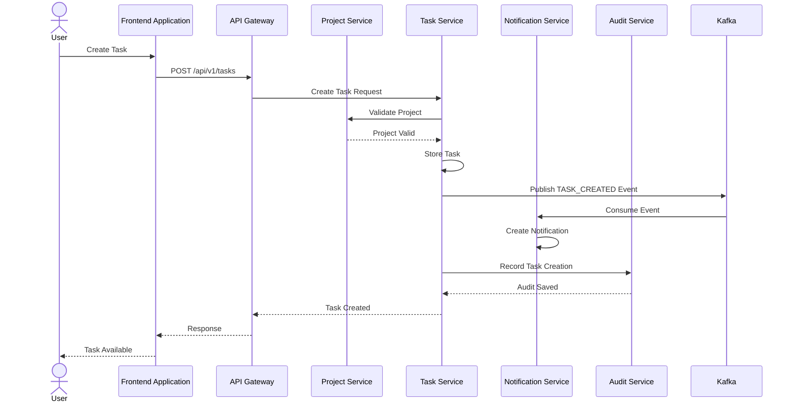

---

# Task Creation Rules

| Rule ID | Description |
|---------|-------------|
| SEQ-TASK-001 | Task must belong to a valid project. |
| SEQ-TASK-002 | Task creation generates business events. |
| SEQ-TASK-003 | Notifications are processed asynchronously. |
| SEQ-TASK-004 | Task activities are audited. |

---

# 11. Task Assignment Flow

## Overview

This flow describes assigning a task to an employee.

Components involved:

- Task Service
- User Service
- Notification Service
- Audit Service

---

## Sequence Diagram

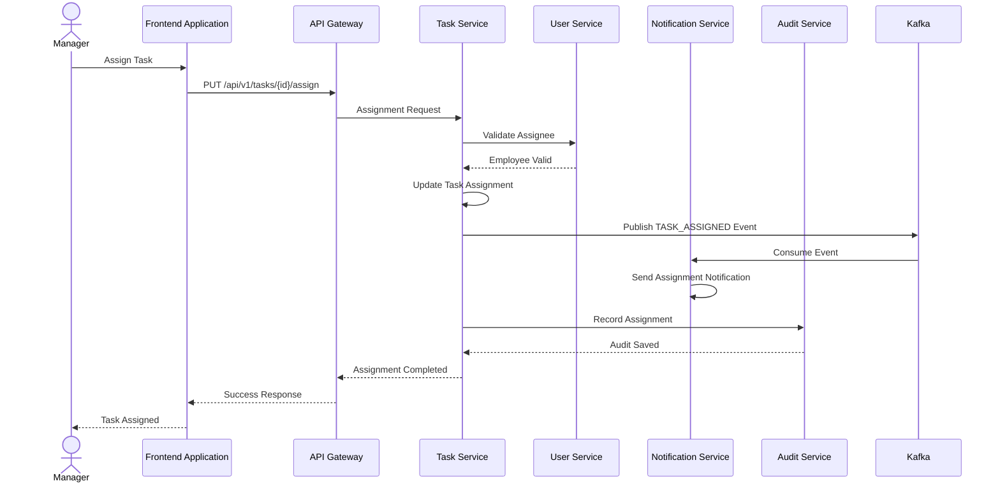

---

# Task Assignment Rules

| Rule ID | Description |
|---------|-------------|
| SEQ-ASSIGN-001 | Assignee must exist in organization. |
| SEQ-ASSIGN-002 | Assignment changes must be audited. |
| SEQ-ASSIGN-003 | Notifications are generated asynchronously. |

---

# 12. Document Upload Flow

## Overview

The Document Upload Flow describes how users upload documents into WorkSphere.

Actual file content is stored in MinIO.
Metadata is stored inside Document Service database.

Components involved:

- Document Service
- MinIO
- Workspace Service
- Notification Service
- Audit Service

---

## Sequence Diagram

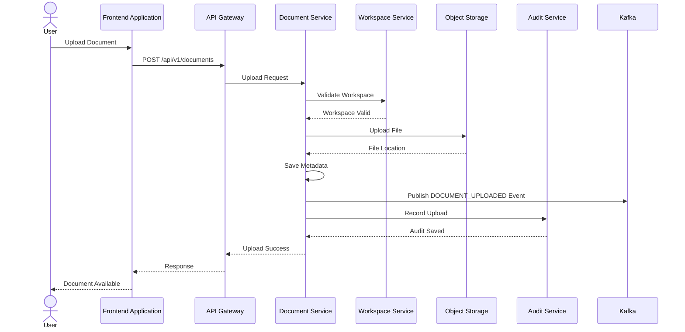

---

# Document Upload Rules

| Rule ID | Description |
|---------|-------------|
| SEQ-DOC-001 | Binary files are stored only in MinIO. |
| SEQ-DOC-002 | Database stores metadata only. |
| SEQ-DOC-003 | Upload operations generate audit events. |
| SEQ-DOC-004 | Document events can trigger notifications. |

---

# End of Part 3

---

# 13. Notification Processing Flow

## Overview

The Notification Flow describes how WorkSphere generates and delivers
notifications after business events.

Notifications are processed asynchronously to avoid impacting core
business transactions.

Components involved:

- Business Service
- Kafka Event Bus
- Notification Service
- Email Provider / External Channels
- Audit Service

---

## Sequence Diagram

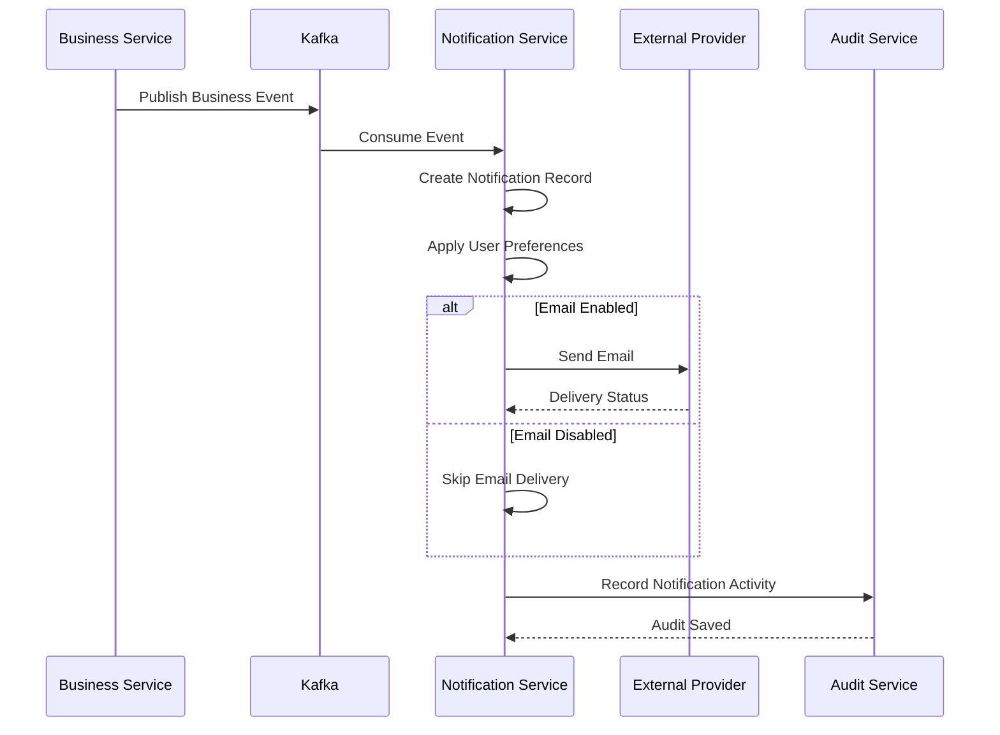

---

# Notification Processing Rules

| Rule ID | Description |
|---------|-------------|
| SEQ-NOTI-001 | Notifications must not block business transactions. |
| SEQ-NOTI-002 | Delivery status must be tracked. |
| SEQ-NOTI-003 | User preferences override default settings. |
| SEQ-NOTI-004 | Failed deliveries must support retry mechanisms. |

---

# 14. Audit Logging Flow

## Overview

Audit logging provides complete traceability of important system activities.

Every critical business action generates an audit record.

Components involved:

- User
- API Gateway
- Business Service
- Audit Service
- Audit Database

---

## Sequence Diagram

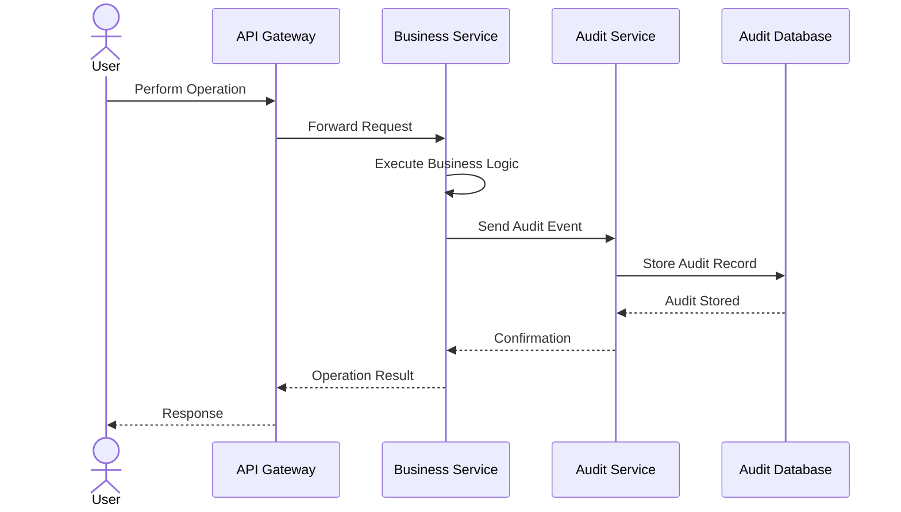

---

# Audit Logging Rules

| Rule ID | Description |
|---------|-------------|
| SEQ-AUDIT-001 | Security-related operations must be logged. |
| SEQ-AUDIT-002 | Audit records are immutable. |
| SEQ-AUDIT-003 | Audit failure must not corrupt business transactions. |
| SEQ-AUDIT-004 | Audit data must support investigation purposes. |

---

# 15. Event Driven Communication Flow

## Overview

WorkSphere uses asynchronous event communication between services.

Events reduce coupling and allow independent service evolution.

Communication pattern:

```
Producer Service

        |

        v

Kafka Event Bus

        |

        v

Consumer Services
```

---

## Example: Task Created Event

Scenario:

A new task is created.

---

## Sequence Diagram

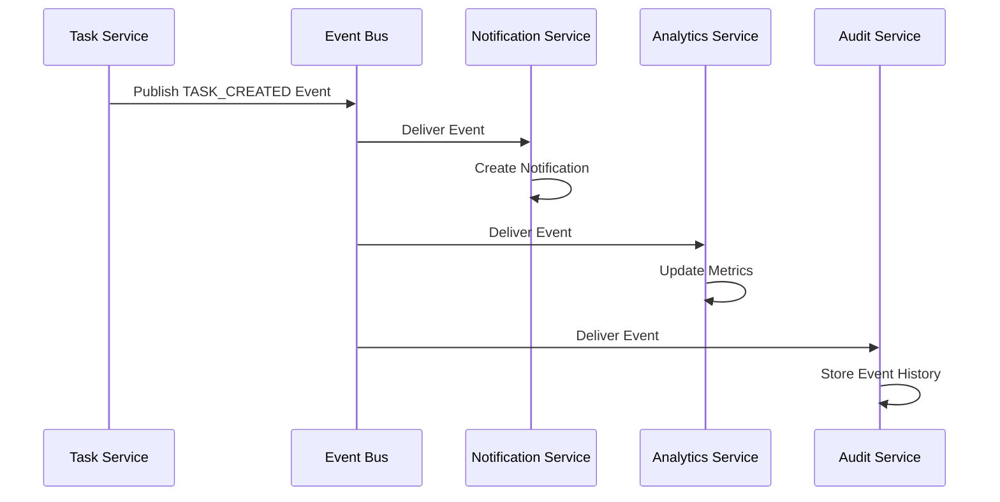

---

# Event Rules

| Rule ID | Description |
|---------|-------------|
| SEQ-EVENT-001 | Events must represent completed business actions. |
| SEQ-EVENT-002 | Events should be immutable. |
| SEQ-EVENT-003 | Consumers must handle duplicate events safely. |
| SEQ-EVENT-004 | Failed event processing must support retry. |

---

# 16. Error Handling Flow

## Overview

This flow defines how WorkSphere handles failures during API execution.

Error handling follows centralized API standards.

Components involved:

- Frontend Application
- API Gateway
- Business Service
- Exception Handler
- Audit Service

---

## Sequence Diagram

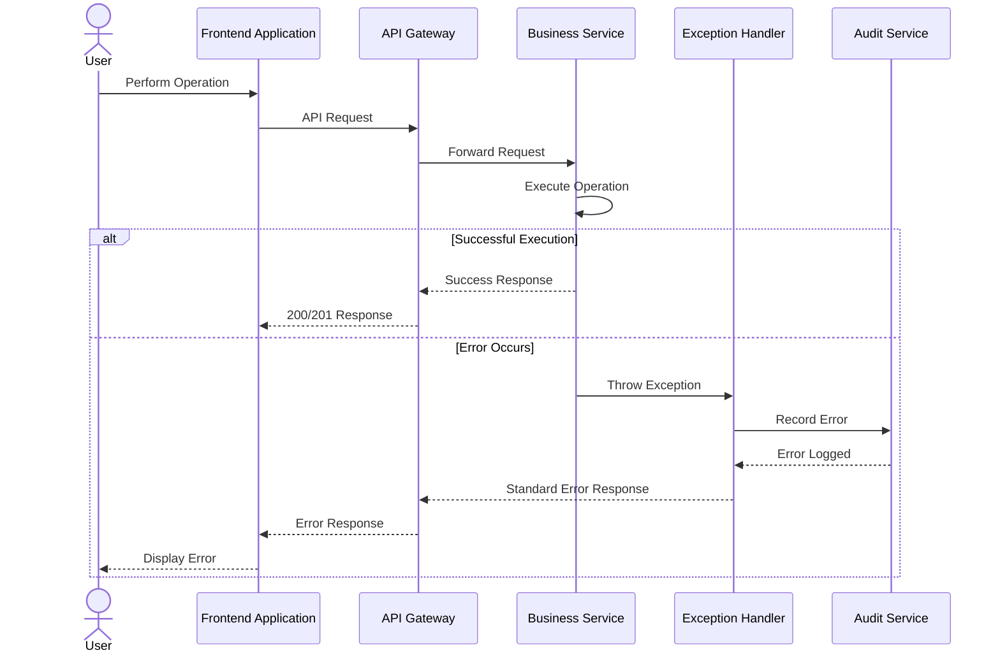

---

# Error Handling Rules

| Rule ID | Description |
|---------|-------------|
| SEQ-ERR-001 | All APIs must return standard error responses. |
| SEQ-ERR-002 | Internal exceptions must not expose sensitive information. |
| SEQ-ERR-003 | Errors must include trace identifiers. |
| SEQ-ERR-004 | Critical failures must be logged. |

---

# End of Part 4

---

# 17. System Wide Communication Overview

## Overview

The following diagram represents the overall runtime communication model
of the WorkSphere platform.

It shows how external users interact with the platform through the API
Gateway and how services communicate using synchronous APIs and
asynchronous events.

---

## High Level Sequence Diagram

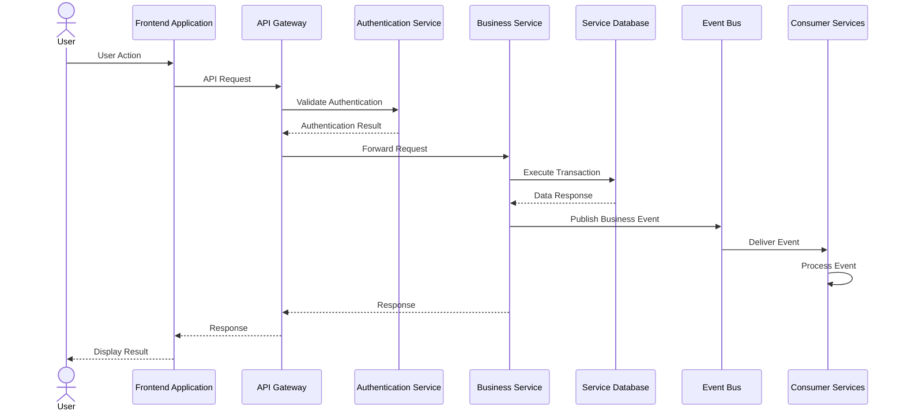

---

# 18. Sequence Design Principles

The following principles govern all runtime interactions inside
WorkSphere.

| Principle ID | Description |
|--------------|-------------|
| SEQ-PR-001 | Services communicate only through defined contracts. |
| SEQ-PR-002 | Database access remains inside service boundaries. |
| SEQ-PR-003 | Long-running operations should be asynchronous. |
| SEQ-PR-004 | Business events represent completed actions. |
| SEQ-PR-005 | Every critical operation must be traceable. |
| SEQ-PR-006 | Failures must be handled gracefully. |

---

# 19. Distributed Transaction Handling

## Overview

WorkSphere avoids distributed transactions across microservices.

Instead, the platform uses:

- Event-driven communication
- Eventual consistency
- Retry mechanisms
- Idempotent processing

---

## Example Flow

Scenario:

Creating a task and notifying users.

Traditional Approach:

```
Task Creation
      |
      |
Notification
      |
      |
Audit
```

Problem:

Failure in notification can rollback task creation.

---

WorkSphere Approach:

```
Task Service

   |
   |
Create Task

   |
   |
TASK_CREATED Event

   |
   |
+----------------+
|                |
v                v

Notification     Audit
Service          Service
```

Benefits:

- Independent failures
- Better scalability
- Loose coupling
- Improved resilience

---

# 20. Idempotency Standards

## Overview

Distributed systems may deliver duplicate messages.

All event consumers must safely handle duplicate processing.

---

## Rules

| Rule ID | Description |
|---------|-------------|
| IDEMP-001 | Events must contain unique identifiers. |
| IDEMP-002 | Consumers must track processed events. |
| IDEMP-003 | Duplicate processing must not create duplicate records. |

---

# 21. Observability Requirements

Every sequence flow must support monitoring and troubleshooting.

Required tracking information:

| Field | Purpose |
|-------|---------|
| Request ID | Request tracing |
| Correlation ID | Distributed tracing |
| User ID | User accountability |
| Service Name | Component identification |
| Timestamp | Event ordering |
| Execution Status | Monitoring |

---

# 22. Sequence Diagram Implementation Guidelines

During implementation:

- Mermaid diagrams should be maintained with architecture changes.
- New business flows require updated sequence diagrams.
- Service communication changes require documentation updates.
- API changes must reflect sequence changes.
- Event changes must update related diagrams.

---

# 23. Related Documents

This document should be read together with:

| Document | Purpose |
|----------|---------|
| 05_System_Architecture.md | Overall system architecture |
| 05A_Context_Diagram.md | System boundary definition |
| 05B_Container_Diagram.md | Runtime containers |
| 05C_Component_Diagram.md | Service components |
| 06_Architecture_Decision_Record.md | Architectural decisions |
| 06A_Technology_Stack.md | Technology standards |
| 07_Database_Design.md | Database architecture |
| 07A_ER_Diagram.md | Entity relationships |
| 08_API_Design.md | API specifications |
| Authentication.md | Security architecture |
| Authorization.md | Access control |

---

# 24. Future Enhancements

Future sequence diagrams may include:

- AI Assistant Interaction Flow
- Search Service Flow
- Real-time Collaboration Flow
- Chat Integration Flow
- External Application Integration Flow
- Data Synchronization Flow
- Disaster Recovery Flow
- Backup Restoration Flow

---

# Version History

| Version | Date | Description | Author |
|---------|------|-------------|--------|
| 1.0 | July 2026 | Initial Sequence Diagram document | Bhargav Kaushik |

---

# End of Document